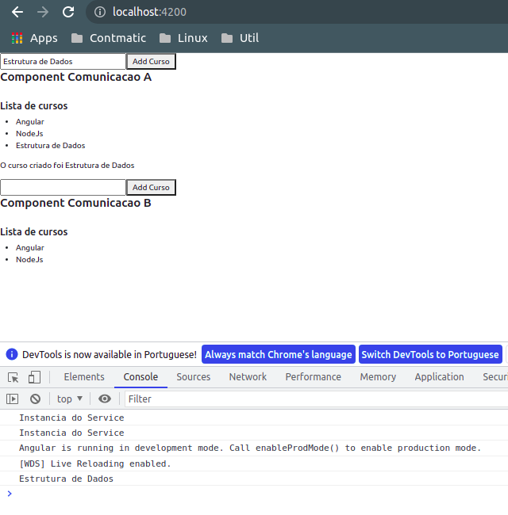
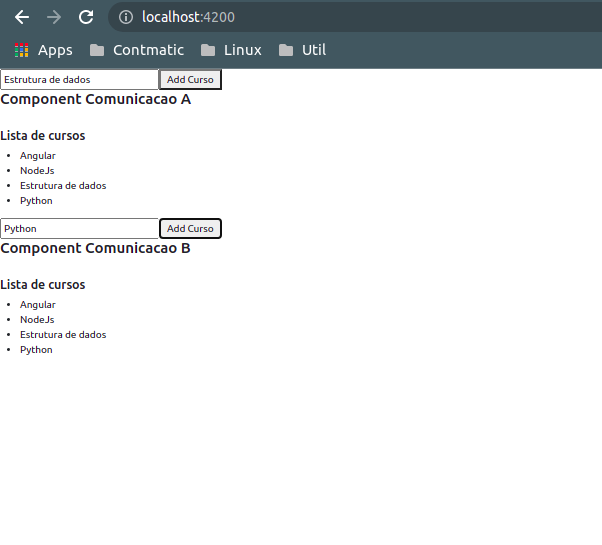

# __COMUNICACAO ENTRE COMPONENTS USANDO SERVICES (BROADCASTING)__ 

 Para fazer um comparativo vamos retomar o conceito de Input properties (decorator `@Input()`) utilizado para receber dados do _component_ pai no component filho e Output properties (decorator `@Output()`) utilizado para transmitir dados do component filho para o component pai. Porem no caso da utilizacao de classes que sao independentes entre si, (os _components_ nao possuem relacao de pai e filho e cada _component_ possui sua respectiva instancia da classe _service_, vide a documentacao sobre [Escopo de Instancias de Services](04-escopo-de-instancias.md)) utiliza-se classes _service_ para realizar a transmissao de dados entre _components_.

 ___component_ A__:

 ```typescript
 import { Component, OnInit } from '@angular/core';

import { ComumService } from './../comum.service';

@Component({
  selector: 'app-component-comunicacao-a',
  templateUrl: './component-comunicacao-a.component.html',
  styleUrls: ['./component-comunicacao-a.component.css'],
  providers: [ComumService]
})
export class ComponentComunicacaoAComponent implements OnInit {

  constructor(private comumService: ComumService) { }

  ngOnInit(): void {
  }

  onSalvarCurso(curso: string){
    this.comumService.addCurso(curso)
  }

}
 ```
___template_ do _component_ A:__

```HTML
<div>
    <input type="text" #cursoInput>
    <button (click)="onSalvarCurso(cursoInput.value)">Add Curso</button>

    <h4> Component Comunicacao A</h4>
    <br>
    <h5>Lista de cursos</h5>
    <ul>
        <li *ngFor="let curso of cursos">
            {{ curso }}
        </li>
    </ul>
</div>
```
 ___component_ B__:
 ```typescript
import { Component, OnInit } from '@angular/core';

import { ComumService } from './../comum.service';

@Component({
  selector: 'app-component-comunicacao-b',
  templateUrl: './component-comunicacao-b.component.html',
  styleUrls: ['./component-comunicacao-b.component.css'],
  providers: [ComumService]
})
export class ComponentComunicacaoBComponent implements OnInit {

  cursos: string[] = []

  constructor(private comumService: ComumService) { }

  ngOnInit(): void {
    this.cursos = this.comumService.getCursos()
  }

  onSalvarCurso(curso: string){
    this.comumService.addCurso(curso)
  }

}
 ```
___template_ do _component_ B:__
```HTML
<div>
    <input type="text" #cursoInput>
    <button (click)="onSalvarCurso(cursoInput.value)">Add Curso</button>

    <h4> Component Comunicacao B</h4>
    <br>
    <h5>Lista de cursos</h5>
    <ul>
        <li *ngFor="let curso of cursos">
            {{ curso }}
        </li>
    </ul>
</div>
```

__comum _service___:

```typescript
import { Injectable, EventEmitter } from '@angular/core';

@Injectable()
export class ComumService {

  // emissor de evento
  emitirCursoCriado = new EventEmitter<string>();

  cursos: string[] = ['Angular', 'NodeJs']

  constructor() { 
    console.log('Instancia do Service')
  }

  getCursos(){
    return this.cursos
  }

  addCurso(curso: string){
    this.cursos.push(curso)

    // emitir curso criado
    this.emitirCursoCriado.emit(curso)
  }
}
```


#
## __COMUNICACAO ENTRE COMPONENTS QUE COMPARTILHAM A MESMA INSTANCIA DO SERVICE__
Ao declarar o `selector` de um _component_ A no template de outro _component_ B (o _component_ A torna-se filho do _component_ B) onde o component A e B necessitam das mesmas dependencias, caso nao declarada no codigo uma instancia para o _component_ A, a instancia do _component_ B sera automaticamente compartilhada para ambos.

Para exemplificar vamos estabelecer uma relacao entre os components por meio de seus templates.

___template_ do _component_ comunicacao A (_component_ pai):__
```HTML
<div>
    <input type="text" #cursoInput>
    <button (click)="onSalvarCurso(cursoInput.value)">Add Curso</button>

    <h4> Component Comunicacao A</h4>
    <br>
    <h5>Lista de cursos</h5>
    <ul>
        <li *ngFor="let curso of cursos">
            {{ curso }}
        </li>
    </ul>

    <!--declaracao do component filho no component pai-->
    <app-receber-curso></app-receber-curso>
</div>
```

___template_ do receber curso (_component_ filho):__

```HTML
<p *ngIf="curso.length != 0">O curso criado foi {{ curso }}</p>
```

___component_ receber curso:__
```typescript
import { Component, OnInit } from '@angular/core';

import { ComumService } from './../../comum.service';

@Component({
  selector: 'app-receber-curso',
  templateUrl: './receber-curso.component.html',
  styleUrls: ['./receber-curso.component.css'],
})
export class ReceberCursoComponent implements OnInit {

  curso: string = ""

  constructor(private comumService: ComumService) { }

  ngOnInit(): void {
    this.comumService.emitirCursoCriado.subscribe(
      cursoCriado => this.curso = cursoCriado
    )
  }
}
```
note que `ComponentComunicacaoAComponent` (component pai) ja pussui uma instancia da classe `comumService` declarada em seu meta-dado `providers`, logo a classe `receberCurso`, recebera a mesma instancia como dependencia por padrao. Deste modo e possivel utilizar o metodo `subscribe()` (sera chamado toda vez que ocorrer qualquer mudanca na respectiva instancia de `comumService`), para adicionar o dado a variavel `curso` declarada em `ReceberCursoComponent`

<p align="center">
    <br>
    figura 1 - Broadcasting utilizando a mesma instancia de um service
</p>

#
## __COMUNICACAO ENTRE COMPONENTS COM SUAS RESPECTIVAS INSTANCIAS__

Para tornar o atributo `emitirCursoCriado` comum independente das instancias podemos declara-lo como `static`.

__comum _service___:
```typescript
import { Injectable, EventEmitter } from '@angular/core';

@Injectable()
export class ComumService {

  // emissor de evento
  static emitirCursoCriadoEstatico = new EventEmitter<string>();

  cursos: string[] = ['Angular', 'NodeJs']

  constructor() { 
    console.log('Instancia do Service')
  }

  getCursos(){
    return this.cursos
  }

  addCurso(curso: string){

    // emitir curso criado
    ComumService.emitirCursoCriadoEstatico.emit(curso)
  }
}
```
vamos alterar a implementacao do metodo `subscribe()`  em ambos os _components_ para que seja chamado a partir da classe estatica, e assim adicionar o novo curso ao array `cursos`.

 ___component_ A__:
```typescript
import { Component, OnInit } from '@angular/core';

import { ComumService } from './../comum.service';

@Component({
  selector: 'app-component-comunicacao-a',
  templateUrl: './component-comunicacao-a.component.html',
  styleUrls: ['./component-comunicacao-a.component.css'],
  providers: [ComumService]
})
export class ComponentComunicacaoAComponent implements OnInit {

  cursos: string[] = []

  constructor(private comumService: ComumService) { }

  ngOnInit(): void {
    this.cursos = this.comumService.getCursos()

    // meotodo chamado a partir de atributo ESTATICO quando ha alteracoes na classe ComunService
   ComumService.emitirCursoCriadoEstatico.subscribe(
      curso => this.cursos.push(curso)
    )
  }

  onSalvarCurso(curso: string){
    this.comumService.addCurso(curso)
  }
}
```

 ___component_ B__:
```typescript
import { Component, OnInit } from '@angular/core';

import { ComumService } from './../comum.service';

@Component({
  selector: 'app-component-comunicacao-b',
  templateUrl: './component-comunicacao-b.component.html',
  styleUrls: ['./component-comunicacao-b.component.css'],
  providers: [ComumService]
})
export class ComponentComunicacaoBComponent implements OnInit {

  cursos: string[] = []

  constructor(private comumService: ComumService) { }

  ngOnInit(): void {
    this.cursos = this.comumService.getCursos()
    

    ComumService.emitirCursoCriadoEstatico.subscribe(
      cursoCriado => this.cursos.push(cursoCriado)
    )
  }

  onSalvarCurso(curso: string){
    this.comumService.addCurso(curso)
  }

}
```
<p align="center">
    <br>
    figura 2 - Broadcasting utilizando instancias diferentes de um service
</p>
