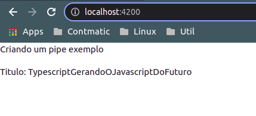

# Criando um pipe

As classes do angular que possum o decorator `@Pipe()` necessitam implementar a interface `PipeTransform` e sobrescrever o metodo `transform()`, neste sera declarada a logica responsavel por realizar a filtragem.

O decorator `@Pipe()` recebe como argumento um objeto, que contem `name` como atributo, este sera a referencia utilizada para chamar o pipe no template HTML.

__classe _pipe_ gerada com angular CLI:__
```typescript
import { Pipe, PipeTransform } from '@angular/core';

@Pipe({
  name: 'pipePersonalizado'
})
export class PipePersonalizadoPipe implements PipeTransform {

  transform(value: unknown, ...args: unknown[]): unknown {
    return null;
  }
}
```
para exemplificar vamos implementar uma logica que identifica os espacamentos entre as palavras e transforma no padrao camelCase. 

```typescript
import { Pipe, PipeTransform } from '@angular/core';

@Pipe({
  name: 'pipePersonalizado'
})
export class PipePersonalizadoPipe implements PipeTransform {

  transform(value: any, ...args: any[]): any {

    let resultado = ""
    let palavras = value.split(' ')

    for(let palavra of palavras){
      resultado += this.mudarPrimeiraLetraParaCaixaAlta(palavra)
    }

    return resultado;
  }

  mudarPrimeiraLetraParaCaixaAlta(palavra: string){
    return palavra.substring(0,1).toUpperCase() +
      palavra.substring(1).toLowerCase()

  }
}
```
inicialmente declaramaos 2 variaveis `resultado` que ira armazenar o valor a ser retornado apos tratado, e `palavra`, um array que ira armazenar as palavras individualmente, o metodo `split()` separa a string em substrins separadas pela string passada como argumente nesse caso um espaco. Um laco `for` ira aplicar a logica do metodo `mudarPrimeiraLetraParaCaixaAlta()` em todas as palavras contidas no array e por fim o resultado sera retornado.

Para realizar a implementacao do pipe no _template_ basta declara-lo de arcordo com a sintaxe ja vista.

```HTML
<p>Criando um pipe exemplo</p>
<p>Titulo: {{ livro.titulo | pipePersonalizado }}</p>
```
<p align="center">
    <br>
    figura 1 - pipe para tornar o texto no padrao camelCase
</p>

E importante resaltar que os pipes nativos fazem parte do commom package disponivel no java core, esta disponiveis por padrao no escopo global da aplicacao, para definir os escopos de pipes personalizados, devem ser declarados no meta-dado `declaratons` dos mudulos.