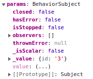
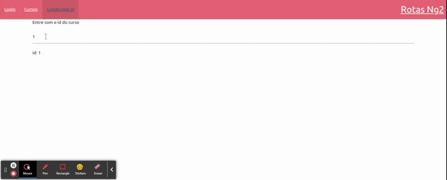

# Escutando mudancas nos parametros de rotemento

utilizando o exemplo [Definindo e Extraindo Parametros de Roteamento](05-definindo-e-extraindo-parametros-de-roteamento.md), alem do atributo `snapshot` outro atributo de interesse neste momento e o atributo `params` que possui o objeto `BehaviorSubject` do pacote `rxjs` que muda dinamicamente conforme as alteracoes na rota, deste modo e possivel se inscrever neste objeto para escutar alteracoes utilizando o metodo `subject()`.

<p align="center">
    <br>
</p>

#### Alteracoes na classe __CursoDetalhe__

```typescript
import { Component, OnInit } from '@angular/core';
import { ActivatedRoute } from '@angular/router';
import { Subscription } from 'rxjs';

@Component({
  selector: 'app-curso-detalhe',
  templateUrl: './curso-detalhe.component.html',
  styleUrls: ['./curso-detalhe.component.css']
})
export class CursoDetalheComponent implements OnInit {

  id: string = "";
  inscricao: Subscription = new Subscription()

  constructor(private _route: ActivatedRoute) {
    /* 
        note que a logica foi movida para o metodo 
        ngOnInit() que pertence aos life cicle hooks 
        do angular. 
    /*
   }

  ngOnInit(): void {
    /* 
        note que podemos armazenar a inscricao em uma variavel
        do tipo Subscription, deste modo, podemos remover a 
        inscricao no momento da destruicao do objeto, pois
        nao e interesante manter a inscricao em um objeto 
        inexistente.
    */
    this.inscricao = this._route.params.subscribe( // inscricao no atributo params
      (params: any) => {
        this.id = params['id']
      }
    )
  }


  ngOnDestroy(): void{
    // remocao da inscricao no momento da destruicao do component
    this.inscricao.unsubscribe()
  }
}
```

<p align="center">
    <br>
</p>


