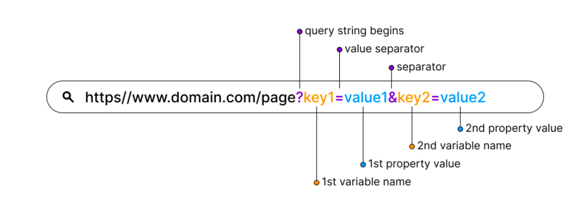
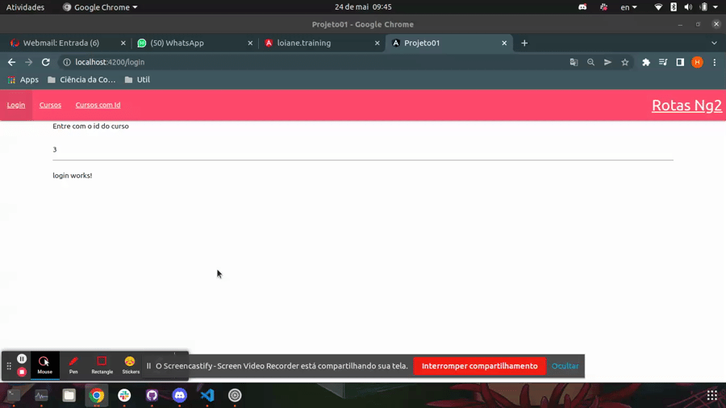
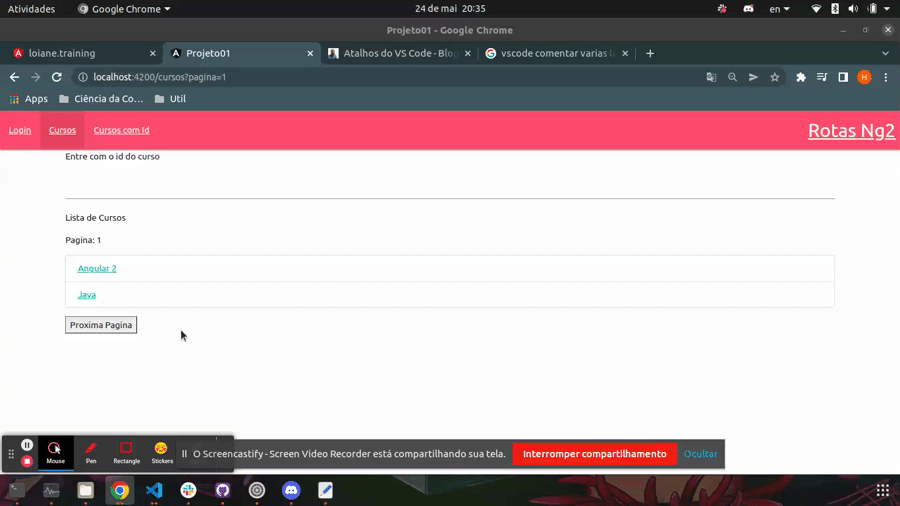

# Defininido e Extraindo Paramatros de URL (Query Params)

Parametros de query em uma URL sao utilizados normalmente para organizar ou filtrar recursos, para identificar os parametros sao separados do `path` param (utilizado para especificar qual recurso da API esta sento solicitado), por `?` e designados por chave e valor conforme o exemplo

<p align="center">
    <br>
    exemplo de URL com query params.
</p>

#
## Incluindo parametros de query nas rotas

Alem da diretiva `routerLink` o Angular tambem possui a diretiva `queryParams` que e utilizada para passar os parametros de query para a rota, conforme o exemplo.

```typescript
...

<li routerLinkActive="active"><a routerLink="/cursos" [queryParams]="{pagina:1}">Cursos</a></li>

...
```

<p align="center">
    <br>
    exemplo de URL com _query params_.
</p>

#
## Extraindo parametros de query nas rotas

A extracao dos _query params_ ocorre de forma similar aos _path params_ (parametros de rota) por meio da classe `ActivatedRoute`. uma variavel com o identificador `pagina` do tipo `number` sera utilizada para armazenar o valor do query param. Lembrando que para manter as boas praticas de codigo a inscricao sera armazenada em um objeto do tipo Subscription para que possa ser realizada a desinscricao no momento da destruicao do objeto.

```typescript
...

import { Subscription } from 'rxjs';
import { CursosServiceService } from './cursos-service.service';
import { ActivatedRoute } from '@angular/router';

@Component({
  selector: 'app-cursos',
  templateUrl: './cursos.component.html',
  styleUrls: ['./cursos.component.css']
})
export class CursosRotasComponent implements OnInit {

  ...

  pagina: number = 0
  inscricao: Subscription

  constructor(
    ...
    private _route: ActivatedRoute) {

  }

  ngOnInit(): void {
    
    ...

    // atributo queryParams da classe ActivatedRoute
    this.inscricao = this._route.queryParams.subscribe( 
      (queryParams: any) => {
        this.pagina = queryParams['pagina']
      }

    )
  }

  ngOnDestroy(){
    this.inscricao.unsubscribe()
  }

  proximaPagina(): void {
    this.pagina++
  }
}

```

um botao no template HTML sera utilizado para chamar o metodo `proximaPagina()` e a variavel pagina sera exibida por meio de interpolacao.

```HTML
<p>Lista de Cursos</p>
<p>Pagina: {{ pagina }}</p>
<div class="collection">
    <a class="collection-item"
    *ngFor="let curso of cursos"
    [routerLink]="['/curso', curso.id]">
        {{ curso.nome }}
    </a>
</div>
<button (click)="proximaPagina()">Proxima Pagina</button>

```
<p align="center">
    <br>
</p>

#
## Utilizando [navegacao imperativa](07-rotas-imperativas-redirecionamento-via-codigo.md) com os _query params_

vamos incluir a classe `Router` e utilizar o metodo `navigate`

```typescript
...

import { ActivatedRoute, Router } from '@angular/router';

...

  constructor(
    ...
    private _router: Router) {
  }

  ...

  proximaPagina(): void {

    // navegacao imperativa
    this._router.navigate(
      ['/cursos'],
      {
        queryParams: {
          'pagina': ++this.pagina
        }
      }
    )
  }

}
```

<p align="center">
    <br>
</p>
