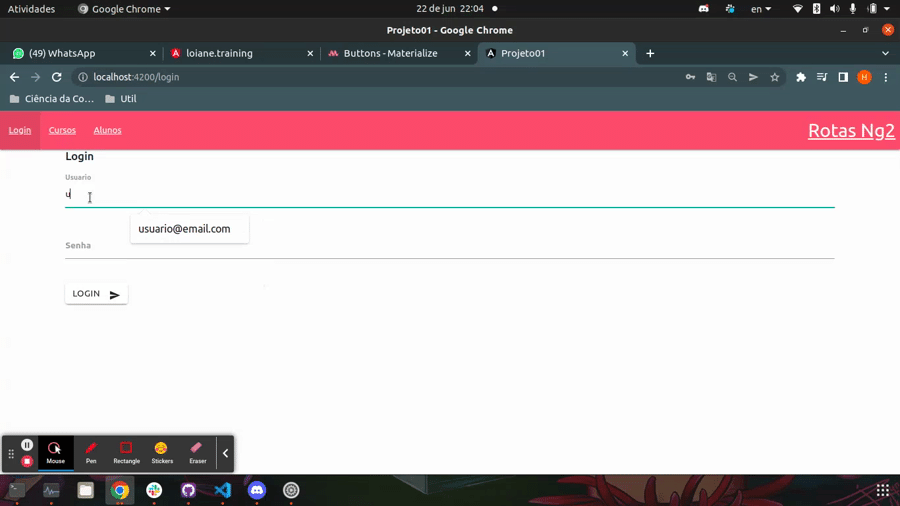

# Rotas Tela de Login: Nao Mostrar Menu

## Utilizando Materialize CSS para desenvolver a tela de Login

Neste exemplo vamos utilizar os campos de formulario disponiveis em [Forms](http://archives.materializecss.com/0.100.2/forms.html) na secao ___Prefilling Text Inputs___, e um [botao](http://archives.materializecss.com/0.100.2/buttons.html) disponivel na secao __Botao Submit__.

- login.component.html

```HTML
<h5>Login</h5>
<br>
<div class="row">
  <div class="input-field col s6">
    <label class="active" for="usuario">Usuario</label>
    <input [(ngModel)]="usuario.nome" id="usuario" type="text" class="validate">
  </div>
</div>

<div class="row">
  <div class="input-field col s6">
    <label class="active" for="senha">Senha</label>
    <input [(ngModel)]="usuario.senha" type="password" class="validate">
  </div>
</div>

<button
  class="btn waves-effect waves-light"
  type="submit"
  name="action"
  (click)="fazerLogin()"
>
  Login
  <i class="material-icons right">send</i>
</button>
```
os dados do formulario serao obtidos por meio da diretiva `ngModel` que realiza o _two way data binding_ entre o codigo typescript e HTML, e o botao chamara o metodo `fazerLogin()` que sera responsavel por implementar a chamada da camada de servico responsavel pela autenticacao do usuario.

- login.component.ts

```typescript
import { Usuario } from './usuario.model';
import { AuthService } from './auth.service';
import { Component, OnInit } from '@angular/core';

@Component({
  selector: 'app-login',
  templateUrl: './login.component.html',
  styleUrls: ['./login.component.css']
})
export class LoginComponent implements OnInit {

  public usuario: Usuario = new Usuario()

  constructor(private auth: AuthService) { }

  ngOnInit(): void {

  }

  fazerLogin(){
    this.auth.autenticar(this.usuario)
  }

}
```

Para trabalhar com os dados referentes a autenticacao iremos trabalhar com uma classe de Mock (simulando um service) e criar uma classe `Usuario` que servira como modelo de dados.

- auth.service.ts (classe que contem dados mocados)

```typescript
import { Router } from '@angular/router';
import { Usuario } from './usuario.model';
import { Injectable } from '@angular/core';

@Injectable({
  providedIn: 'root'
})
export class AuthService {

  usuarioAutenticado: boolean = false

  constructor(private router: Router) { }

  autenticar(usuario: Usuario): void {
    if(usuario.nome === 'usuario@email.com' && usuario.senha === '1234') {
      this.usuarioAutenticado = true
      this.router.navigate(['/'])
      return
    }
    this.usuarioAutenticado = false
  }
}

```

- usuario.model.ts (modelo de dados)

```typescript
export class Usuario {
  nome: string
  senha: string
}
```

<p align="center">
    <br>
    tela de login funcional.
</p>

## Removendo NavBar da tela de Login

Existem diversas formas de implementar esta logica
- utilizando Observables e BehaviorSubject (Assunto ainda nao visto)
- Declarando o conteudo da NavBar em um rota filha separadamente da tela de login
- Utilizando a diretiva `ngIf` para exibir ou nao o NavBar.

vamos implementar a logica mais simples, utilizando o ngIf, para isto vamos utilizar um `EventEmitter` na class `AuthService`

```typescript
//...demais imports omitidos
import { Injectable, EventEmitter } from '@angular/core';

//...decorator @Injectable omitido
export class AuthService {

  //...demais variaveis omitidas
  mostrarMenuEmitter = new EventEmitter<boolean>()

  //...construtor omitido

  autenticar(usuario: Usuario): void {
    if(usuario.nome === 'usuario@email.com' && usuario.senha === '1234') {
      //...codigo omitido
      this.mostrarMenuEmitter.emit(true)
     
    }
    //...codigo omitido
    this.mostrarMenuEmitter.emit(false)
  }
}
```

No `app.component.ts` iremos criar uma variavel do tipo `boolean` para receber o valor emitido pelo `EventEmitter` fazer a inscricao na variavel da class `AuthService`

```typescript
//...demais imports omitidos
import { AuthService } from './_06-rotas/rotas/login/auth.service';

//...decorator @Component omitido
export class AppComponent {
  
  //...demais variaveis omitidas

  mostrarMenu: boolean = false

  constructor(private authService: AuthService) { }

  ngOnInit() {
    this.authService.mostrarMenuEmitter.subscribe((mostrar => {
      this.mostrarMenu = mostrar
      console.log(mostrar)
    }))
  }

  //...demais metodos omitidos
}
```
no HTML na tag `nav` iremos inserir a diretiva `ngIf`, deste modo a barra de navegacao sera exibida apenas se o valor emitido for `true`

```HTML
<nav *ngIf="mostrarMenu">
    <!-- codigo omitido -->
</nav>
<!-- codigo omitido -->
```

<p align="center">
    <br>
    tela de login funcional.
</p>

