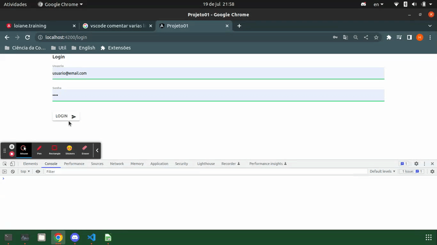

# Guarda Rotas: Resolve - carregando dados antes da rota ser ativa

Em determinados casos torna-se necessario que dados sejam processados antes da renderizacao do component, como por exemplo para requisicoes que possuem tempos longos (requisicoes ajax, podem demorar alguns segundos), nestes casos e possivel utilizar o guarda rotas `Resolve` para que o componente seja renderizado apos o carregamento dos dados.

Similar a todos os guarda de rotas sua implementacao tambem parte da _interface_ `Resolve` (note que esta interface recebe um tipo generico, que e o tipo de dado que sera carregado, neste caso estamos utilizado a classe `AlunosModel` que e a abstracao dos dados de alunos) e necessita a implementacao do metodo `resolve`, note que neste caso o construtor recebe a injecao de dependencia do um objeto do tipo `AlunosService`, pois este ira realizar a requisicao ao servidor (no caso do exemplo `AlunosService` e apenas uma classe com dados Mock), para carregar os dados antes do inicio da renderizacao do component.

OBS: Para este exemplo iremos implementar `console.log` nos metodos chamados para observar a ordem que o angular ira executar cada metodo

```typescript
import { AlunosService } from './../rotas/alunos/alunos.service';
import { AlunoModel } from '../rotas/alunos/aluno.model';

import { Injectable } from '@angular/core';
import { Resolve, ActivatedRouteSnapshot, RouterStateSnapshot } from '@angular/router';
import { Observable } from 'rxjs';

@Injectable({ providedIn: 'root' })
export class AlunoDetalheResolver implements Resolve<AlunoModel> {

  constructor(private service: AlunosService){ }

  resolve(route: ActivatedRouteSnapshot, state: RouterStateSnapshot): AlunoModel | Observable<AlunoModel> | Promise<AlunoModel> {

    console.log('Resolver') // metodo para observar no console

    const id = route.params['id']
    return this.service.getAluno(id)
  }
}
```

para recuperar os dados carregados previamente a renderizacao do component, iremos utilizar a injecao de dependencia `ActivatedRoute` (classe nativa do package `@angular/router`) e atraves da inscricao no atributo `data` obter os dados.

```typescript
// ...demais imports omitidos
import { AlunoModel } from './../aluno.model';
import { ActivatedRoute, Router } from '@angular/router';

@Component({
  selector: 'app-aluno-detalhe',
  templateUrl: './aluno-detalhe.component.html',
  styleUrls: ['./aluno-detalhe.component.css']
})
export class AlunoDetalheComponent implements OnInit {

  // ...demais atributos omitidos
  public aluno: AlunoModel


  constructor(
    private _route: ActivatedRoute,
    private _router: Router,
  ) {
  }

  ngOnInit(): void {
    console.log('ngOnInit') // metodo para observar no console

    // obtendo dados pre-carregados pelo Resolver
    this._route.data.subscribe((x) => this.aluno = x.aluno)
  }

  // ...demais metodos omitidos
}
```
Note a ordem da saida no console

<p align="center">
    
<br>
    guarda rotas Resolve.
</p>
