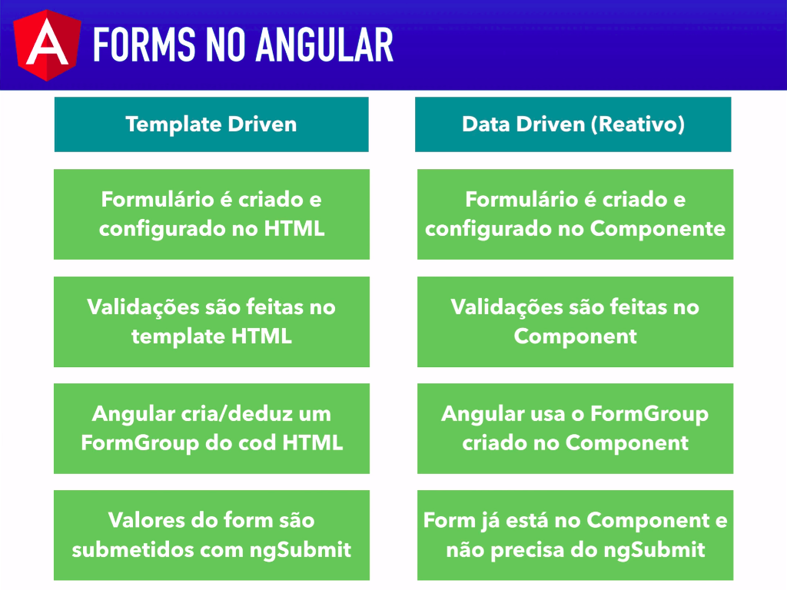

# Formularios: Template driven x Data driven

Existem duas maneiras de manipular formularios no Angular, o template driven, onde o formulario e construido no html, e data driven onde o formulario e construido na classe do _compoenent_.

 
   
    Diferencas entre template driven e data driven. fonte: Loiane.training

