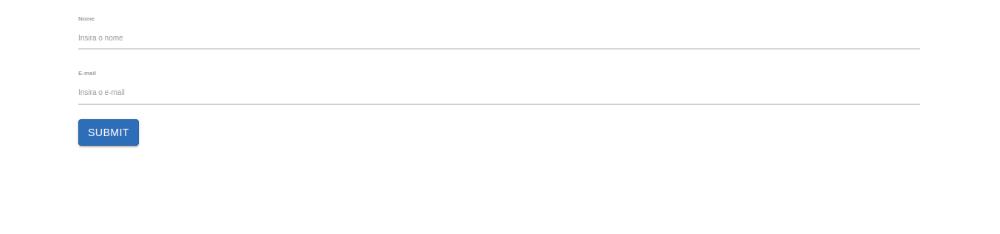

# Criando Projeto Inicial com Bootstrap 3

## Estrutura basica para implementar os formularios durante o curso
Caso o projeto ainda nao tenha o bootstrap css instalado, acesse a [documentacao oficial](https://getbootstrap.com/docs/3.3/getting-started/) para instalar.

Inicialmente iremos criar dois _components_, o primeiro para o modulo de template driven e o segundo para o modulo de data driven

com a seguinte estrutura de pastas 

```
_07-formularios/
  |
  |-- template-driven/
  |         |-- template-driven.component.css
  |         |-- template-driven.component.html
  |         |-- template-driven.component.ts
  |
  |-- data-driven/
  |         |-- data-driven.component.css
  |         |-- data-driven.component.html
  |         |-- data-driven.component.ts
  |
  |-- forms-angular.module.ts
  |-- forms-angular.routing.module.ts
```

OBS: lembre-se de importar modulo `FormsAngularModule` no modulo em `AppModule` (modulo raiz).

apos criar os _components_ `TemplateDrivenForm` e `DataDrivenForm` e necessario declarar as rotas no modulo `FormsAngularRoutingModule`

```typescript
import { FormsAngularModule } from './forms-angular.module';
import { NgModule } from "@angular/core";
import { RouterModule, Routes } from '@angular/router';
import { DataDrivenFormComponent } from './data-driven/data-driven-form/data-driven-form.component';
import { TemplateDrivenFormComponent } from './template-driven/template-driven-form.component';

const ROTAS_ROUTES: Routes = [
  { path: 'template-driven', component: TemplateDrivenFormComponent },
  { path: 'data-driven', component: DataDrivenFormComponent }
]

@NgModule({
  imports: [
    RouterModule.forChild(ROTAS_ROUTES),
  ]
})
export class FormsAngularRoutingModule {}
```

e incluir os _components_ na secao `declarations` em `FormsAngularModule` e na secao `imports` incluir `FormsAngularRoutingModule`.

```typescript
import { FormsAngularRoutingModule } from './forms-angular.routing.module';
import { TemplateDrivenFormComponent } from './template-driven/template-driven-form.component';
import { NgModule } from "@angular/core";
import { FormsModule } from '@angular/forms';
import { DataDrivenFormComponent } from './data-driven/data-driven-form/data-driven-form.component';

@NgModule({
  declarations: [
    TemplateDrivenFormComponent,
    DataDrivenFormComponent
  ],
  imports: [
    FormsModule,
    FormsAngularRoutingModule
  ],
})
export class FormsAngularModule { }
```
deste modo temos a estrutura basica para continuar o modulo de formularios do curso.

## Criacao template driven form

Apos a estrutura basica ser criada, vamos iniciar o modelo de formulario com a inclusao de dois campos simples utilizando as classes de estilo do bootstrap css.

```HTML
<form>
  <div class="form-group">
      <label for="nome">Nome</label>
      <input type="text" class="form-control" id="nome" placeholder="Insira o nome">
  </div>
  <div class="form-group">
    <label for="email">E-mail</label>
    <input type="email" class="form-control" id="email" placeholder="Insira o e-mail">
</div>
<button type="submit" class="btn btn-primary">Submit</button>
</form>
```
<p align="center"> 
  <br>
    Template driven formulario simples.
</p>


