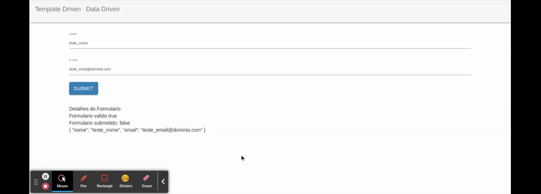

# Verificando dados do form no template com Json

Como ferramenta para auxiliar no desenvolvimento, podemos criar um _compoenent_ para observar os dados e o comportamento do form sem necessariamente ter que clicar no botao de submit e exibilo no console, para este exemplo o _component_ `formDebugComponent` sera criado e recebera o formulario atraves de property binding para exibir seus valores formatados utilizando o pipe `json`.

```typescript
import { Component, Input } from '@angular/core';

@Component({
  selector: 'app-form-debug',
  templateUrl: './form-debug.component.html',
  styleUrls: ['./form-debug.component.css']
})
export class FormDebugComponent {

  @Input() formulario: any; 

}
```
```HTML
<div *ngIf="formulario" style="margin-top: 30px;">
  <div>Detalhes do Formulario</div>
  <div>Formulario valido {{ formulario.valid }}</div>
  <div>Formulario submetido: {{ formulario.submitted }}</div>
  <div>{{ formulario.value | json }}</div>
</div>
```

para adicionar o novo _component_ na tela do formulario, incluir sua tag no template do formulario e passar o formulario por property binding.

```HTML
<form #formulario="ngForm" (ngSubmit)="onSubmit(formulario)">
  <div class="form-group">
      <label for="nome">Nome</label>
      <input type="text" class="form-control" id="nome" placeholder="Insira o nome" name="nome" [(ngModel)]="usuario.nome"
        required
        [class.has-error]="nome.touched && nome.invalid"
        #nome="ngModel"
      >
      <div *ngIf="nome.touched && nome.invalid" class="alert alert-danger">
        O nome e obrigatorio
      </div>
  </div>
  <div class="form-group">
    <label for="email">E-mail</label>
    <input type="email" class="form-control" id="email" placeholder="Insira o e-mail" name="email" [(ngModel)]="usuario.email"
      required email
    >
</div>
<button type="submit" class="btn btn-primary" [disabled]="formulario.invalid">Submit</button>
</form>
<app-form-debug [formulario]="formulario"></app-form-debug>
```

<p align="center"> 
  <br>
    debug component.
</p>

