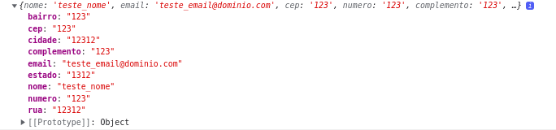
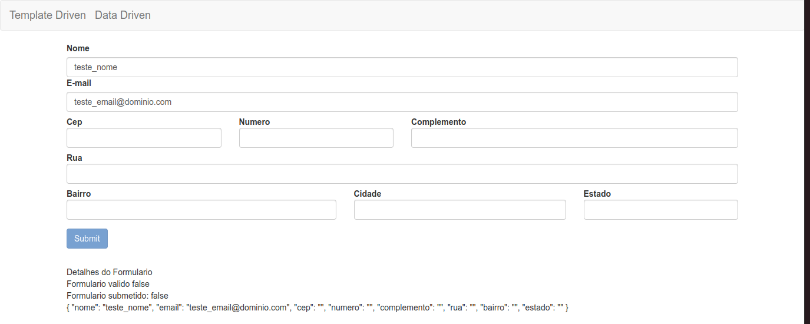

# Agrupando dados com ngModelGroup

O form desenvolvido em [Refatorando CSS e mensagens de erro](./12-refatorando-css-e-mensagens-de-erro.md) possui todos os formularios no mesmo objeto, caso desejemos separar determinados campos como atributos de um unico objeto no form, podemo utilizar a diretiva `ngModelGroups`.

observe a estrutura atual do form.

<p align="center"> 
  <br>
    form sem ngModelGroup
</p>

```HTML
<form #formulario="ngForm" class="form-horizontal" (ngSubmit)="onSubmit(formulario)">
  <div class="form-group">
    <div class="col-sm-12">
      <label for="nome">Nome</label>
      <input type="text" class="form-control" [ngClass]="aplicaCssErro(nome)" id="nome" placeholder="Insira o nome"
        name="nome" [(ngModel)]="usuario.nome" required #nome="ngModel" />
      <app-campo-erro [mostrarErro]="validaCampo(nome)" mensagemErro="O campo nome e obrigatorio"></app-campo-erro>
    </div>
    <div class="col-sm-12">
      <label for="email">E-mail</label>
      <input type="email" class="form-control" [ngClass]="aplicaCssErro(email)" id="email" placeholder="Insira o e-mail"
        name="email" [(ngModel)]="usuario.email" required email #email="ngModel" />
      <app-campo-erro [mostrarErro]="validaCampo(email)" mensagemErro="O campo email e obrigatorio"></app-campo-erro>
    </div>
    <!--ngModelGroup adicionado-->
    <div ngModelGroup="endereco">
      <div class="col-md-3">
        <label for="cep" class="control-label">Cep</label>
        <input type="text" class="form-control" id="cep" name="cep" ngModel required #cep="ngModel" />
        <app-campo-erro [mostrarErro]="validaCampo(cep)" mensagemErro="O campo cep e obrigatorio"></app-campo-erro>
      </div>
      <div class="col-md-3">
        <label for="numero" class="control-label">Numero</label>
        <input type="text" class="form-control" id="numero" name="numero" ngModel required #numero="ngModel" />
        <app-campo-erro [mostrarErro]="validaCampo(numero)" mensagemErro="O campo numero e obrigatorio">
        </app-campo-erro>
      </div>
      <div class="col-md-6">
        <label for="complemento" class="control-label">Complemento</label>
        <input type="text" class="form-control" id="complemento" name="complemento" ngModel
          #complemento="ngModel" />
      </div>
      <div class="col-md-12">
        <label for="rua" class="control-label">Rua</label>
        <input type="text" class="form-control" id="rua" name="rua" ngModel required #rua="ngModel" />
        <app-campo-erro [mostrarErro]="validaCampo(rua)" mensagemErro="O campo rua e obrigatorio"></app-campo-erro>
      </div>
      <div class="col-md-5">
        <label for="bairro" class="control-label">Bairro</label>
        <input type="text" class="form-control" id="bairro" name="bairro" ngModel required #bairro="ngModel" />
        <app-campo-erro [mostrarErro]="validaCampo(bairro)" mensagemErro="O campo bairro e obrigatorio">
        </app-campo-erro>
      </div>
      <div class="col-md-4">
        <label for="complemento" class="control-label">Cidade</label>
        <input type="text" class="form-control" id="cidade" name="cidade" ngModel required #cidade="ngModel" />
        <app-campo-erro [mostrarErro]="validaCampo(cidade)" mensagemErro="O campo cidade e obrigatorio">
        </app-campo-erro>
      </div>
      <div class="col-md-3">
        <label for="estado" class="control-label">Estado</label>
        <input type="text" class="form-control" id="estado" name="estado" ngModel required #estado="ngModel" />
        <app-campo-erro [mostrarErro]="validaCampo(estado)" mensagemErro="O campo estado e obrigatorio">
        </app-campo-erro>
      </div>
    </div>
  </div>
  <button type="submit" class="btn btn-primary" [disabled]="formulario.invalid">
    Submit
  </button>
</form>
<app-form-debug [formulario]="formulario"></app-form-debug>

```

<p align="center"> 
  <br>
    form com ngModelGroup
</p>

note que os campos foram aninhados dentro da estrutura do objeto `endereco`.
