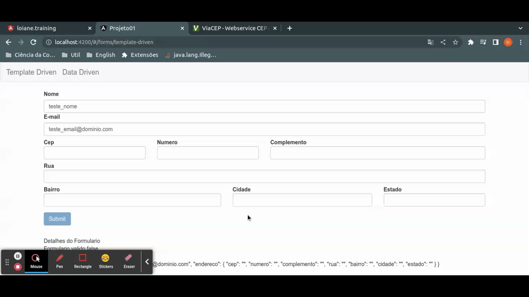
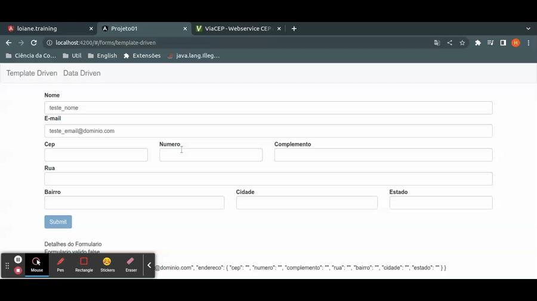

# Populando campos com setValue e patchValue (autocomplete)

`setValue` e `PatchValue` na diretiva `ngForm`, sao metodos responsaveis por alterar os dados do formulario. No caso do `setValue` a argumento esperado e um objeto que possui todos os campos do formulario, pois todos os valores serao atualizados e no caso do `patchValue` o argumento esperado e um objetos que possua apenas os atributos que desejamos alterar no form, os atributos nao contidos no argumento irao permanecer inalterados.

## Utilizando `SetValue`

```typescript
import { map } from 'rxjs/operators';
import { HttpClient } from '@angular/common/http';
import { Component, OnInit } from '@angular/core';
import { NgForm } from '@angular/forms';
@Component({
  selector: 'app-template-driven-form',
  templateUrl: './template-driven-form.component.html',
  styleUrls: ['./template-driven-form.component.css']
})
export class TemplateDrivenFormComponent implements OnInit {

  // ...atributos

 // ...demais metodos

  public consultaCep(cep: string, form: NgForm) {
    const SOMENTE_DIGITOS_REGEX: RegExp = /\D/g
    const VALIDA_CEP_REGEX: RegExp = /^[0-9]{8}$/
    cep = cep.replace(SOMENTE_DIGITOS_REGEX, "")
    if(cep !== "" && VALIDA_CEP_REGEX.test(cep)) {
      this.http.get(`https://viacep.com.br/ws/${cep}/json/`).pipe(map(dados => dados))
        .subscribe(dados => {
          console.log(dados)
          this.populaDadosForm(dados, form)
        })
    }
  }

  private populaDadosForm(dados: any, form: NgForm) {
    form.setValue({
      nome: null,
      email: null,
      endereco: {
        cep: dados.cep,
        numero: null,
        rua: dados.logradouro,
        complemento: dados.complemento,
        bairro: dados.bairro,
        cidade: dados.localidade,
        estado: dados.uf
      }
    })
  }

}
```

Note que ao utilizar o `setValue` se os campos `nome`, `email` e `numero` ja estiverem preechidos seus valores serao perdidos.

<p align="center"> 
  <br>
    utilizando setValue
</p>

## Utilizando `patchValue`

o metodo `patchValue` e uma metodo da classe `FormGroup`, note que o formulario possui um atributo com a key `form`, este e um objeto do tipo `FormGroup` e atraves dele o metodo `patchValue` pode ser chamado, seu comportamento e similar ao metodo `setValue`, porem a argumento pode receber um objeto que possui apenas os campos que deseja-se que sejam alterados.


```typescript
import { map } from 'rxjs/operators';
import { HttpClient } from '@angular/common/http';
import { Component, OnInit } from '@angular/core';
import { NgForm } from '@angular/forms';
@Component({
  selector: 'app-template-driven-form',
  templateUrl: './template-driven-form.component.html',
  styleUrls: ['./template-driven-form.component.css']
})
export class TemplateDrivenFormComponent implements OnInit {

  // ... demais atributos

  // ...demais metodos

  public consultaCep(cep: string, form: NgForm) {
    const SOMENTE_DIGITOS_REGEX: RegExp = /\D/g
    const VALIDA_CEP_REGEX: RegExp = /^[0-9]{8}$/
    cep = cep.replace(SOMENTE_DIGITOS_REGEX, "")
    if(cep !== "" && VALIDA_CEP_REGEX.test(cep)) {
      this.http.get(`https://viacep.com.br/ws/${cep}/json/`).pipe(map(dados => dados))
        .subscribe(dados => {
          console.log(dados)
          this.populaDadosForm(dados, form)
        })
    }
  }

  private populaDadosForm(dados: any, formulario: NgForm) {
    formulario.form.patchValue({
      endereco: {
        cep: dados.cep,
        rua: dados.logradouro,
        complemento: dados.complemento,
        bairro: dados.bairro,
        cidade: dados.localidade,
        estado: dados.uf
      }
    })
  }

}
```

<p align="center"> 
  <br>
    utilizando patchValue
</p>
