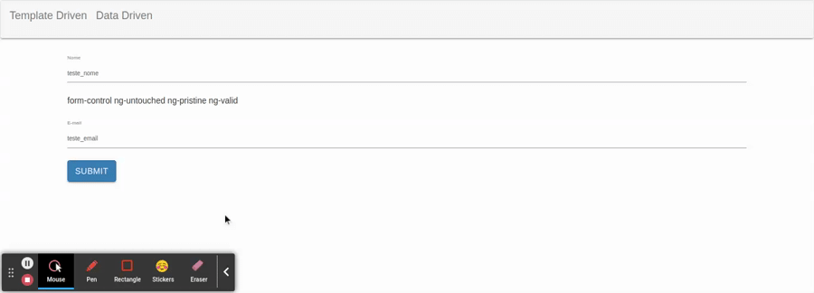

# Aplicando CSS na validacao dos campos

Para efeito de aprendizado, iremos realizar uma pequena modificacao no template para exibir quais classes estao sendo aplicadas ao input

```HTML
<input type="text" class="form-control" id="nome" placeholder="Insira o nome" name="nome" [(ngModel)]="usuario.nome"
        required #nome
      >
      <div>
        {{ nome.className }}
      </div>
```

note que a tag `input` possui uma variavel `#nome` para referencia-la, e logo apos na `div` existe uma interpolacao para exibir auis as classes aplicadas a tag `input`

O Angular aplica classes conforme os validadores.

<p align="center"> 
  <br>
    exibindo classes aplicadas na validacao dos campos.
</p>

deste modo e possivel declarar as classes no arquivo de estilo e quando os validadoes aplicarem suas determinadas classes ao _component_ o CSS sera aplicado.

```CSS
input.ng-invalid.ng-touched {
  border: 1px red solid;
  border-radius: 7px;
}
```

<p align="center"> 
  <br>
    aplicando CSS na validacao dos campos.
</p>
