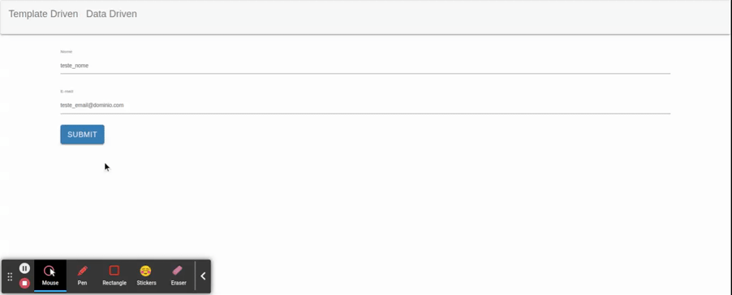

# Desabilitando Botao de Submit para Formulario Invalido

A variavel `formulario` declarada na tag `form` possui a propriedade `valid` que tera o valor `true` apenas se todos os campos do formulario forem validos. Neste caso podemos utilizar o valor da propriedade `valid` do formulario e passa-lo para o atributo `disabled` na tag `button`.

```HTML
<form #formulario="ngForm" (ngSubmit)="onSubmit(formulario)">
  <div class="form-group">
      <label for="nome">Nome</label>
      <input type="text" class="form-control" id="nome" placeholder="Insira o nome" name="nome" [(ngModel)]="usuario.nome"
        required
        [class.has-error]="nome.touched && nome.invalid"
        #nome="ngModel"
      >
      <div *ngIf="nome.touched && nome.invalid" class="alert alert-danger">
        O nome e obrigatorio
      </div>
  </div>
  <div class="form-group">
    <label for="email">E-mail</label>
    <input type="email" class="form-control" id="email" placeholder="Insira o e-mail" name="email" [(ngModel)]="usuario.email"
      required email
    >
</div>
<button type="submit" class="btn btn-primary" [disabled]="formulario.invalid">Submit</button>
</form>
```

<p align="center"> 
  <br>
    desabilitando botao submit para formulario invalido.
</p>
