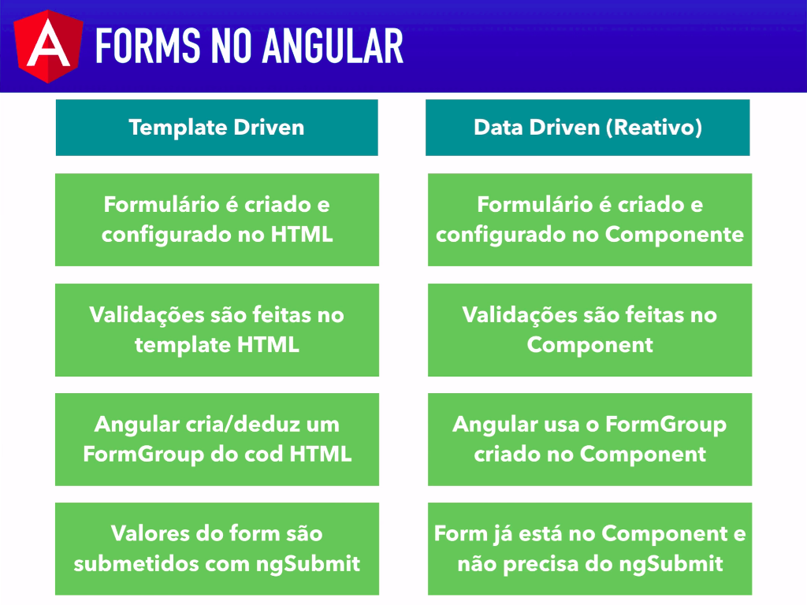

# Formulario Data Driven: Introducao

Diferente dos formularios template driven, os formularios data driven sao criados programaticamente e associados ao DOM/HTML os formularios sao declarados no codigo typescript/javascript do template.

 
   
    Diferencas entre template driven e data driven. fonte: Loiane.training

