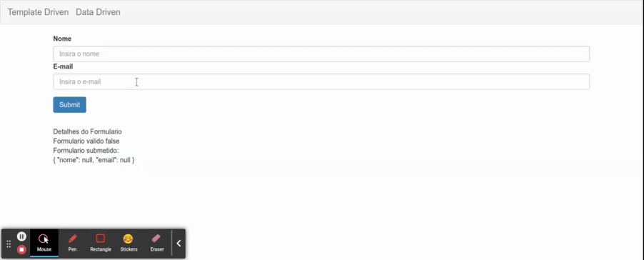

# Sincronizando HTML com FormGroup

No caso dos formularios data driven, e necessario identificar qual campo no template HTML corresponte ao respectivo objeto do tipo `FormControl` no `FormGroup`

para representar o `FormGroup` no template HTML o pacote `ReactiveForm` possui a diretiva `formGroup`, neste caso iremos declarar utilizando property binding, pois sempre que os valores do formulario forem alterados no componente, serao atualizado no template. de forma similar os campos do formulario sao associados aos `FormControl` por meio da diretiva `formControlName` que tambem pertence ao pacote `ReactiveForm` do Angular core. vide [Criando Form com Codigo Angular](03-criando-form-com-codigo-angular.md) para o codigo typescript.

```HTML
<form class="form-horizontal" [formGroup]="formulario">
  <div class="form-group">
    <div class="col-sm-12">
      <label for="nome">Nome</label>
      <input type="text" class="form-control" id="nome" placeholder="Insira o nome"
        formControlName="nome" required/>
    </div>
    <div class="col-sm-12">
      <label for="email">E-mail</label>
      <input type="email" class="form-control" id="email" placeholder="Insira o e-mail"
        formControlName="email" required email/>
    </div>
  </div>
  <button type="submit" class="btn btn-primary">Submit</button>
</form>
<app-form-debug [formulario]="formulario"></app-form-debug>
```


<p align="center"> 
  <br>
    Associando o codigo do component ao template HTML.
</p>

