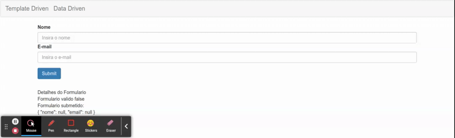

# Aplicando Validacao nos Campos

As validacoes no caso de templates data driven, podem ser aplicadas deretamente no template HTML como nos exemplos da secao de formularios template driven, ou aplicadas como segundo argumento do array de configuracoes do `FormBuilder`. Utilizando a classe [`Validators`](https://angular.io/api/forms/Validators) do Angular.

```typescript
import { HttpClient } from '@angular/common/http';
import { Component, OnInit } from '@angular/core';
import { FormBuilder, FormGroup, Validators } from '@angular/forms';

@Component({
  selector: 'app-data-driven-form',
  templateUrl: './data-driven-form.component.html',
  styleUrls: ['./data-driven-form.component.css']
})
export class DataDrivenFormComponent implements OnInit {

  public formulario: FormGroup

  constructor(private formBuilder: FormBuilder, private http: HttpClient) { }

  ngOnInit(): void {
    this.formulario = this.formBuilder.group({
      // adicionados os validadores
      nome: [null, Validators.required],
      email: [null, [Validators.required, Validators.email]]
    })
  }

  public onSubmit(): void {
    console.log(this.formulario);
    console.log(this.formulario.value);
    this.http.post('enderecoServidor/formUsuario', JSON.stringify(this.formulario.value))
      .subscribe(response => console.log(response))
  }

}
```

neste caso, como os validadores estao declarados diretamente no objeto `FormControl` de cada campo nao e necessario declaralos no template HTML.

```HTML
<form class="form-horizontal" [formGroup]="formulario" (ngSubmit)="onSubmit()">
  <div class="form-group">
    <div class="col-sm-12">
      <label for="nome">Nome</label>
      <input type="text" class="form-control" id="nome" placeholder="Insira o nome"
        formControlName="nome"/>
    </div>
    <div class="col-sm-12">
      <label for="email">E-mail</label>
      <input type="email" class="form-control" id="email" placeholder="Insira o e-mail"
        formControlName="email"/>
    </div>
  </div>
  <button type="submit" class="btn btn-primary">Submit</button>
</form>
<app-form-debug [formulario]="formulario"></app-form-debug>
```

<p align="center"> 
  <br>
    Aplicando validacoes no formulario do tipo data driven
</p>
