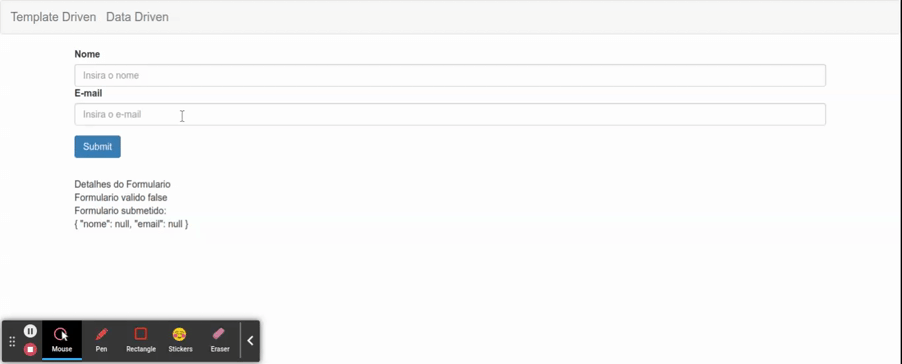

# Acesso aos FormControl e CSS de validacao dos Campos

Para o caso das valicacoes utilizando CSS, e importante resaltar que cada framework possui suas respectivas classes, para este exemplo sao utilizadas as classes do Bootstrap CSS. Utilizando a diretiva `ngClass` o metodo `aplicaCssErro` ira retornar as classes que devem ser aplicadas caso o campo esteja invalido. Note que para o caso dos formuarios do tipo data driven, o argumento passado para os metodos `aplicaCssErro` e `verificaValidAndTouched` sao em forma de string, pois como o formulario esta declarado no codigo typescript do _compoenent_ o metodo `get` (da classe `FormGroup`) espera receber o `formControlName` em forma de string.

```typescript
import { HttpClient } from '@angular/common/http';
import { Component, OnInit } from '@angular/core';
import { FormBuilder, FormGroup, Validators } from '@angular/forms';

@Component({
  selector: 'app-data-driven-form',
  templateUrl: './data-driven-form.component.html',
  styleUrls: ['./data-driven-form.component.css']
})
export class DataDrivenFormComponent implements OnInit {

  public formulario: FormGroup

  constructor(private formBuilder: FormBuilder, private http: HttpClient) { }

  ngOnInit(): void {
    this.formulario = this.formBuilder.group({
      nome: [null, Validators.required],
      email: [null, [Validators.required, Validators.email]]
    })
  }

  public onSubmit(): void {
    console.log(this.formulario);
    console.log(this.formulario.value);
    this.http.post('https://httpbin.org/post', JSON.stringify(this.formulario.value))
      .subscribe(
        response => {
          console.log(response)
          this.resetForm()
        },
        error => {
          console.log('Erro na requisicao')
        }
      )
  }

  public resetForm(): void {
    this.formulario.reset()
  }

  // Metodos para validar formulario

  public aplicaCssErro(nomeCampo: string) {
    return {
      'has-error': this.verificaValidAndTouched(nomeCampo),
      'has-feedback': this.verificaValidAndTouched(nomeCampo)
    }
  }

  public verificaValidAndTouched(nomeCampo: string): boolean {
    return this.formulario.get(nomeCampo)!.invalid && this.formulario.get(nomeCampo)!.touched
  }
}
```

```HTML
<form class="form-horizontal" [formGroup]="formulario" (ngSubmit)="onSubmit()">
  <div class="form-group">
    <div class="col-sm-12" [ngClass]="aplicaCssErro('nome')">
      <label for="nome">Nome</label>
      <input type="text" class="form-control" id="nome" placeholder="Insira o nome"
        formControlName="nome"/>
        <app-campo-erro [mostrarErro]="verificaValidAndTouched('nome')" mensagemErro="O campo nome e obrigatorio">
        </app-campo-erro>
    </div>
    <div class="col-sm-12" [ngClass]="aplicaCssErro('email')">
      <label for="email">E-mail</label>
      <input type="email" class="form-control" id="email" placeholder="Insira o e-mail"
        formControlName="email"/>
        <app-campo-erro [mostrarErro]="verificaValidAndTouched('email')" mensagemErro="O campo email e obrigatorio">
        </app-campo-erro>
    </div>
  </div>
  <button type="submit" class="btn btn-primary">Submit</button>
</form>
<app-form-debug [formulario]="formulario"></app-form-debug>
```

<p align="center"> 
  <br>
    Aplicando css em campos invalidos.
</p>
