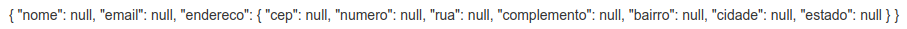

# FormGroups: Agrupando dados

No documento [Migrando formulario template driven para um formulario data driven](09-campos-de-endereco-migrando-um-formulario-template-driven-para-data-driven.md) os campos relativos a endereco foram declarados diretamento no objeto passado como argumento para o `FormBuilder`, porem podemos aninhar outros `FormGroups`.

```typescript
import { HttpClient } from '@angular/common/http';
import { Component, OnInit } from '@angular/core';
import { FormBuilder, FormGroup, Validators } from '@angular/forms';

@Component({
  selector: 'app-data-driven-form',
  templateUrl: './data-driven-form.component.html',
  styleUrls: ['./data-driven-form.component.css']
})
export class DataDrivenFormComponent implements OnInit {

  public formulario: FormGroup

  constructor(private formBuilder: FormBuilder, private http: HttpClient) { }

  ngOnInit(): void {
    this.formulario = this.formBuilder.group({
      nome: [null, Validators.required],
      email: [null, [Validators.required, Validators.email]],
      // aninhando FormGroup
      endereco: this.formBuilder.group({
        cep: [null, Validators.required],
        numero: [null, Validators.required],
        rua: [null, Validators.required],
        complemento: null,
        bairro: [null, Validators.required],
        cidade: [null, Validators.required],
        estado: [null, Validators.required]
      })
    })
  }

  public onSubmit(): void {
    console.log(this.formulario);
    console.log(this.formulario.value);
    this.http.post('https://httpbin.org/post', JSON.stringify(this.formulario.value))
      .subscribe(
        response => {
          console.log(response)
          this.resetForm()
        },
        error => {
          console.log('Erro na requisicao')
        }
      )
  }

  public resetForm(): void {
    this.formulario.reset()
  }

  public aplicaCssErro(nomeCampo: string) {
    return {
      'has-error': this.verificaValidAndTouched(nomeCampo),
      'has-feedback': this.verificaValidAndTouched(nomeCampo)
    }
  }

  public verificaValidAndTouched(nomeCampo: string): boolean {
    return this.formulario.get(nomeCampo)!.invalid && this.formulario.get(nomeCampo)!.touched
  }
}
```
para que o angular identifique os `FormControl` agrupados e necessario incluir os campos em uma div que possui a o atributo `formGroupName` (pare este exemplo recebe como valor `endereco`) e para os metodos `aplicaCssErro` e `verificaValidAndTouched` e necessario passar os controles aninhados, pois o metodo `get` esta sendo chamado pelo `FormGroup` raiz (exemplo para obter o `FormControl` `estado` que esta aninhado no `FormGroup` `endereco` o argumento passado ao metodo deve ser `endereco.estado`).

```HTML
<form class="form-horizontal" [formGroup]="formulario" (ngSubmit)="onSubmit()">
  <div class="form-group">
    <div class="col-sm-12" [ngClass]="aplicaCssErro('nome')">
      <label for="nome">Nome</label>
      <input type="text" class="form-control" id="nome" placeholder="Insira o nome"
        formControlName="nome"/>
        <app-campo-erro [mostrarErro]="verificaValidAndTouched('nome')" mensagemErro="O campo nome e obrigatorio"></app-campo-erro>
    </div>
    <div class="col-sm-12" [ngClass]="aplicaCssErro('email')">
      <label for="email">E-mail</label>
      <input type="email" class="form-control" id="email" placeholder="Insira o e-mail"
        formControlName="email"/>
        <app-campo-erro [mostrarErro]="verificaValidAndTouched('email')" mensagemErro="O campo email e obrigatorio"></app-campo-erro>
    </div>

    <!--Declaracao do formGroupName para agrupar os controles de endereco-->
    <div formGroupName="endereco">

      <!--alterado o argumenro passado ao metodo aplicaCssErro de cep para endereco.cep-->
      <div class="col-md-3" [ngClass]="aplicaCssErro('endereco.cep')">
        <label for="cep" class="control-label">Cep</label>
        <input type="text" class="form-control" id="cep" formControlName="cep"/>

        <!--alterado o argumento passado ao metodo verificaValidAndTouched de cep para endereco.cep-->
        <app-campo-erro [mostrarErro]="verificaValidAndTouched('endereco.cep')" mensagemErro="O campo cep e obrigatorio"></app-campo-erro>
      </div>

      <!--os demais campos seguem as alteracoes feitas no campo cep-->
      <div class="col-md-3" [ngClass]="aplicaCssErro('endereco.numero')">
        <label for="numero" class="control-label">Numero</label>
        <input type="text" class="form-control" id="numero" formControlName="numero"/>
        <app-campo-erro [mostrarErro]="verificaValidAndTouched('endereco.numero')" mensagemErro="O campo numero e obrigatorio"></app-campo-erro>
      </div>
      <div class="col-md-6">
        <label for="complemento" class="control-label">Complemento</label>
        <input type="text" class="form-control" id="complemento" formControlName="complemento"/>
      </div>
      <div class="col-md-12" [ngClass]="aplicaCssErro('endereco.rua')">
        <label for="rua" class="control-label">Rua</label>
        <input type="text" class="form-control" id="rua" formControlName="rua"/>
        <app-campo-erro [mostrarErro]="verificaValidAndTouched('endereco.rua')" mensagemErro="O campo rua e obrigatorio"></app-campo-erro>
      </div>
      <div class="col-md-5" [ngClass]="aplicaCssErro('endereco.bairro')">
        <label for="bairro" class="control-label">Bairro</label>
        <input type="text" class="form-control" id="bairro" formControlName="bairro"/>
        <app-campo-erro [mostrarErro]="verificaValidAndTouched('endereco.bairro')" mensagemErro="O campo rua e obrigatorio"></app-campo-erro>
      </div>
      <div class="col-md-4" [ngClass]="aplicaCssErro('endereco.cidade')">
        <label for="complemento" class="control-label">Cidade</label>
        <input type="text" class="form-control" id="cidade" formControlName="cidade"/>
        <app-campo-erro [mostrarErro]="verificaValidAndTouched('endereco.cidade')" mensagemErro="O campo cidade e obrigatorio">
        </app-campo-erro>
      </div>
      <div class="col-md-3" [ngClass]="aplicaCssErro('endereco.estado')">
        <label for="estado" class="control-label">Estado</label>
        <input type="text" class="form-control" id="estado" formControlName='estado'/>
        <app-campo-erro [mostrarErro]="verificaValidAndTouched('endereco.estado')" mensagemErro="O campo estado e obrigatorio">
        </app-campo-erro>
      </div>
    </div>
  </div>
  <button type="submit" class="btn btn-primary">Submit</button>
</form>
<app-form-debug [formulario]="formulario"></app-form-debug>
```

<p align="center"> 
  <br>
    campos referentes a endereco aninhados.
</p>
