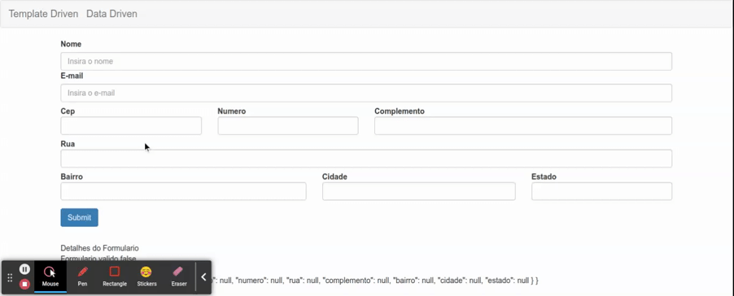

# Autopopulando Campos de Endereco com Cep

Conforme a implementacao desenvolvida no documento [Pesquisa de Endereco por Cep Automaticamente](../07-formularios-template-driven/15-populando-campos-com-setvalue-e-patchvalue.md), a implementacao para o formulario data driven se da de forma similar, A diferenca e que neste caso temos acesso ao objeto do tipo `FormGroup` diretamente no codigo fonte typescript do _component_, portando nao ha necessidade de passar a referencia do formulario do HTML como argumento para a funcao `consultaCep`.

```typescript
import { HttpClient } from '@angular/common/http';
import { Component, OnInit } from '@angular/core';
import { FormBuilder, FormGroup, Validators } from '@angular/forms';
import { map } from 'rxjs/operators';

@Component({
  selector: 'app-data-driven-form',
  templateUrl: './data-driven-form.component.html',
  styleUrls: ['./data-driven-form.component.css']
})
export class DataDrivenFormComponent implements OnInit {

  public formulario: FormGroup

  constructor(private formBuilder: FormBuilder, private http: HttpClient) { }

  // ...demais metodos

  public consultaCep() {
    console.log('entrei');
    const SOMENTE_DIGITOS_REGEX: RegExp = /\D/g
    const VALIDA_CEP_REGEX: RegExp = /^[0-9]{8}$/
    const cep =this.formulario.get('endereco.cep')
    console.log(cep);
    cep?.setValue(cep.value.replace(SOMENTE_DIGITOS_REGEX, ""))
    if(cep?.value !== "" && VALIDA_CEP_REGEX.test(cep?.value)) {
      this.http.get(`https://viacep.com.br/ws/${cep?.value}/json/`).pipe(map(dados => dados))
        .subscribe(dados => {
          console.log(dados)
          this.populaDadosForm(dados)
        })
    }
  }

  private populaDadosForm(dados: any) {
    this.formulario.patchValue({
      endereco: {
        cep: dados.cep,
        rua: dados.logradouro,
        complemento: dados.complemento,
        bairro: dados.bairro,
        cidade: dados.localidade,
        estado: dados.uf
      }
    })
  }
}
```

note que como cep e um `FormControl` aninhado ao `FormGroup` endereco e necessario passar como arumento `endereco.cep` para o metodo `get`.

no HTML basta realizar a chamada do metodo `consultaCep` no evento de `blur` (quando o campo perde o foco) da tag `input`.

```HTML
<!--demais codigo HTML-->

<div class="col-md-3" [ngClass]="aplicaCssErro('endereco.cep')">
  <label for="cep" class="control-label">Cep</label>
  <input type="text" class="form-control" id="cep" formControlName="cep"
    (blur)="consultaCep()"/>
  <app-campo-erro [mostrarErro]="verificaValidAndTouched('endereco.cep')" mensagemErro="O campo cep e obrigatorio"></app-campo-erro>
</div>

<!--demais codigo HTML-->
```

<p align="center"> 
  <br>
    consultando cep.
</p>
