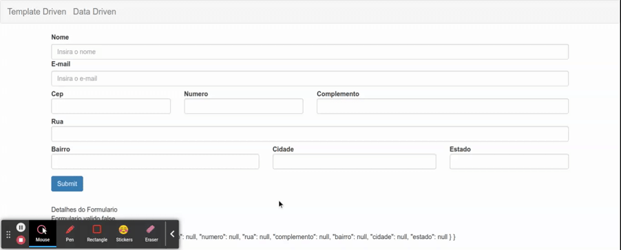

# Verificar Validacao dos Campos com Botao Submit

o metodo `aplicaCssErro` verifica se o campo esta invalido e se ja foi tocado pelo usuario para aplicar o css de erro, porem o usuario pode nao ter tocado em todos os campos antes de realizar a tentativa de submit, para resolver essa questao podemos realizar a chamada do metodo `markAsTouched` da classe `FormControl`, podemos fazer uso da recursividade para acessar os campos aninhados do formulario. Utilizando o metodo `keys` da classe `Object` e possivel extrair um array com as chaves de um objeto (neste exemplo o `FormGroup` raiz).

```typescript
import { HttpClient } from '@angular/common/http';
import { Component, OnInit } from '@angular/core';
import { FormBuilder, FormGroup, Validators } from '@angular/forms';
import { map } from 'rxjs/operators';

@Component({
  selector: 'app-data-driven-form',
  templateUrl: './data-driven-form.component.html',
  styleUrls: ['./data-driven-form.component.css']
})
export class DataDrivenFormComponent implements OnInit {

  public formulario: FormGroup

  constructor(private formBuilder: FormBuilder, private http: HttpClient) { }

  ngOnInit(): void {
    this.formulario = this.formBuilder.group({
      nome: [null, Validators.required],
      email: [null, [Validators.required, Validators.email]],
      endereco: this.formBuilder.group({
        cep: [null, Validators.required],
        numero: [null, Validators.required],
        rua: [null, Validators.required],
        complemento: null,
        bairro: [null, Validators.required],
        cidade: [null, Validators.required],
        estado: [null, Validators.required]
      })
    })
  }

  public onSubmit(): void {
    console.log(this.formulario);
    console.log(this.formulario.value);
    if(this.formulario.valid) {
      this.http.post('https://httpbin.org/post', JSON.stringify(this.formulario.value))
        .subscribe(
          response => {
            console.log(response)
            this.resetForm()
          },
          error => {
            console.log('Erro na requisicao')
          }
        )
    } else {
      this.markControlAsTouched(this.formulario)
    }
  }

  private markControlAsTouched(formulario: FormGroup): void {
    Object.keys(formulario.controls).forEach(key => {
      const control = formulario.get(key)
      control!.markAllAsTouched()
      // chamada recursiva para a propria funcao
      if(control instanceof FormGroup) this.markControlAsTouched(control)
    })
  }

  // ...demais metodos
}
```

<p align="center"> 
  <br>
    validando campos ao clicar em submit.
</p>
