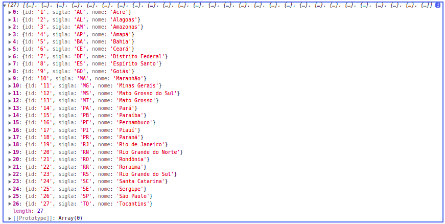

# Criando Servico de Estados Brasileiros

Para realizar a consulta dos estados brasileiros neste exemplo os dados serao alocados diretamente em um arquivo `.json` no projeto no diretorio `assets`, pois, ao fazer o build de producao os arquivos no interior deste diretorio sao compiados para o build final. 

Fonte do `.json`: https://github.com/felipefdl/cidades-estados-brasil-json

alem dos dados uma classe model sera utilizada para tipar o objeto que contem os dados relativos ao estado no json

```typescript
export interface EstadoBr {
  "id": string,
	"sigla": string,
	"nome": string
}
```

o ideal e criar um servico responsavel pelos metodos relativos aos dados do json, neste exemplo itemos criar o `DropdownService`, e possivel obter os valores do ariquvo `.json` utilizando o objeto `http` injetado no service, passando o caminho do arquivo como argumento. para obter os dados iremos implementar o metodo `getEstadosBr`

```typescript
import { HttpClient } from '@angular/common/http';
import { Injectable } from '@angular/core';
import { EstadoBr } from './../../../assets/dados/estados/estados.model';

@Injectable({
  providedIn: 'root'
})
export class DadosService {

  constructor(private http: HttpClient) { }

  public getEstadosBr() {
    return this.http.get<EstadoBr[]>('assets/dados/estados/estados.json')
  }
}
```

no compoenent serao injetado o `dadosService` para obter os estados.

```typescript
import { EstadoBr } from './../../../../assets/dados/estados/estados.model';
import { HttpClient } from '@angular/common/http';
import { Component, OnInit } from '@angular/core';
import { FormBuilder, FormGroup, Validators } from '@angular/forms';
import { map } from 'rxjs/operators';
import { DadosService } from '../../../shared/dropdown/dados.service';

@Component({
  selector: 'app-data-driven-form',
  templateUrl: './data-driven-form.component.html',
  styleUrls: ['./data-driven-form.component.css']
})
export class DataDrivenFormComponent implements OnInit {

  public formulario: FormGroup
  public estados: EstadoBr[];

  constructor(private formBuilder: FormBuilder, private http: HttpClient, private dadosService: DadosService) { }

  ngOnInit(): void {
    this.formulario = this.formBuilder.group({
      nome: [null, Validators.required],
      email: [null, [Validators.required, Validators.email]],
      endereco: this.formBuilder.group({
        cep: [null, Validators.required],
        numero: [null, Validators.required],
        rua: [null, Validators.required],
        complemento: null,
        bairro: [null, Validators.required],
        cidade: [null, Validators.required],
        estado: [null, Validators.required]
      })
    })
    this.dadosService.getEstadosBr().subscribe(
      estados => this.estados = estados
    )
  }

  // ...demais metodos
```


<p align="center"> 
  <br>
    objeto contendo os estados retornados pelo servico.
</p>
