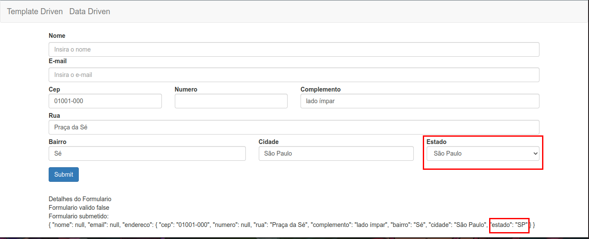

# Combobox Simples

A estrutura basica de um combobox/dropdown e a tag `select` e em seu interior contem as opcoes a serem escolhidas, conforme o exemplo.

```HTML
<select>
  <option>opcao 1</option>
  <option>opcao 2</option>
  <option>opcao 3</option>
</select>
```

Tomando como base o formulario desenvolvido em [Migrando formulario template driven para um formulario data driven](09-campos-de-endereco-migrando-um-formulario-template-driven-para-data-driven.md) e o servico para obter os estados brasileiros desenvolvido em [Criando Servico de Estados Brasileiros](13-criando-um-servico-de-estados-brasileiros.md), vamos alterar o campo "estado" que e a tag `input` para para tag `select` e em seu interior utilizar o `ngFor` para iterar as opcoes obtidas atraves do metodo `getEstadosBr` do servico injetado `DadosService`, no interior da tag deve ser passado o valor que sera exibido como opcao selecionavel, entretando o valor que sera passado ao objeto do tipo `FormGroup` o atribuido ao atributo `value` (neste exemplo "estado.nome").

```HTML
<!--demais codigo HTML-->

<div class="col-md-3" [ngClass]="aplicaCssErro('endereco.estado')">
  <label for="estado" class="control-label">Estado</label>
  <select type="text" class="form-control" id="estado" formControlName='estado'>
    <option *ngFor="let estado of estados" [value]="estado.sigla">{{ estado.nome }}</option>
  </select>
  <app-campo-erro [mostrarErro]="verificaValidAndTouched('endereco.estado')" mensagemErro="O campo estado e obrigatorio">
  </app-campo-erro>
</div>

<!--demais codigo HTML-->
```

deste modo quando o evendo de `blur` do campo "cep" pesquisar por um endereco o estado selecionado, sera o que possui a mesma sigla retornada pelo servico.

<p align="center"> 
  <br>
    valor exibido no combobox e valor passado ao objeto.
</p>

