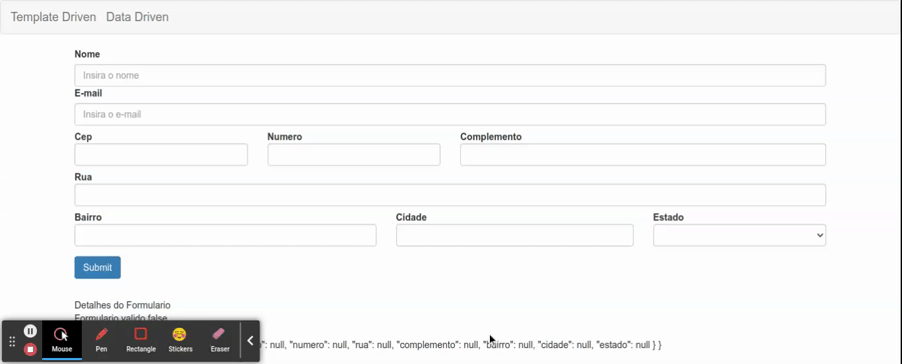
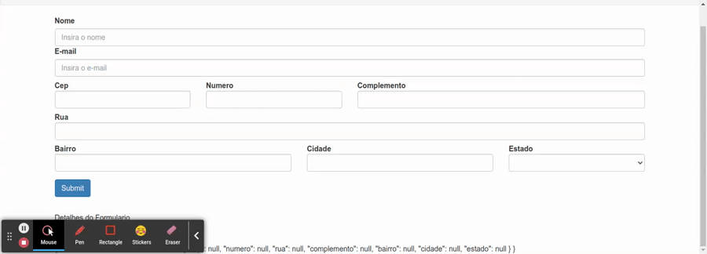

# Combobox com objeto (ngValue e compareWith)

Para trabalhar com valores primitivos como valor do combobox vide [Combobox Simples
](15-combo-box-simples.md).

para exemplificar este cenario, sera utilizado o objeto "estado" que possui os a atributos referentes a endereco, conforme declarado no `FormGroup` no metodo `ngOnInit`

```typescript
ngOnInit(): void {
    this.formulario = this.formBuilder.group({
      nome: [null, Validators.required],
      email: [null, [Validators.required, Validators.email]],
      endereco: this.formBuilder.group({
        cep: [null, Validators.required],
        numero: [null, Validators.required],
        rua: [null, Validators.required],
        complemento: null,
        bairro: [null, Validators.required],
        cidade: [null, Validators.required],
        estado: [null, Validators.required]
      })
    })
    this.dadosService.getEstadosBr().subscribe(
      estados => this.estados = estados
    )
  }
```

para entender como trabalhar com objetos complexos, primeiro precisamos entender como o Angular implementa a comparacao entre um valor obtido pelo formulario e os valores disponiveis nas tags `option`, e ralizada um iteracao utilizando o comparador `===` (este comparador verifica se o endereco de memoria e o mesmo, ou seja e uma comparacao por referencia), portando, e necessario ter muita atencao, pois se o objeto no interior do formulario e o objeto passado como valor nas opcoes tiverem os mesmos atributos com os mesmos valores, porem, estiverem em diferentes enderecos de memoria, a comparacao resultara em false e o valor nao sera setado.

## Cenario de erro

para reprodozir este cenario, vamos utilizar o proprio objeto do tipo `EstadoBr` ao inves do atributo `sigla` contido em seu inteiror, note que ao pesquisar o endereco utilizando o cep, nenhum valor e atributo, pois durante a comparacao nenhum valor com a mesma referencia de memoria foi encontrado.

<p align="center"> 
  <br>
    valor exibido no combobox e valor passado ao objeto.
</p>

Note que ao realizar o caminho inverso, onde ao selecionar um valor no combobox o objeto referente a opcao selecionada (neste caso sua referencia de memoria) e passada como valor para o atributo "estado" no interior do `FormGroup`.

<p align="center">
  <br>
    valor exibido no combobox e valor passado ao objeto.
</p>

## Resolucao

Para contornar o cenario de erro, duas diretivas do angular devem ser utilizadas neste caso, a primeira e [`ngValue`](https://angular.io/api/forms/NgSelectOption) aplicada diretamente nas tags `option`, esta diretiva ira perceber pelo property binding quando algum dos atributos do objeto for alterado, e a segunda diretiva e o [`compareWith`](https://angular.io/api/forms/SelectControlValueAccessor) que possui o algoritmo de comparacao para verificar se os valores entre objetos em diferentes enderecos de memoria sao iguals (neste exemplo iremos comparar apenas pela sigla recebida)

```typescript

```
