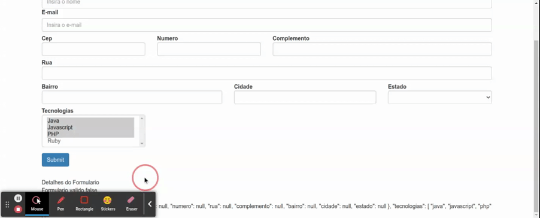

# Combobox Multiplo (Select Multiple)

Para exemplificar este cenario, iremos trabalhar com objetos mackados em um array contendo algumas tecnologias. sera adicionado o novo `FormControl` ao objeto passado como argumento para o metodo `group` do `FormBuilder`.

```typescript
// ... imports

@Component({
  selector: 'app-data-driven-form',
  templateUrl: './data-driven-form.component.html',
  styleUrls: ['./data-driven-form.component.css']
})
export class DataDrivenFormComponent implements OnInit {

  // array parar armazenar as tecnologias retornadas pelo metodo getTecnologias
  public tecnologias: any[] = this.getTecnologias();

  constructor(private formBuilder: FormBuilder, private http: HttpClient, private dadosService: DadosService, private cepService: CepService) { }

  ngOnInit(): void {
    this.formulario = this.formBuilder.group({
      nome: [null, Validators.required],
      email: [null, [Validators.required, Validators.email]],
      endereco: this.formBuilder.group({
        cep: [null, Validators.required],
        numero: [null, Validators.required],
        rua: [null, Validators.required],
        complemento: null,
        bairro: [null, Validators.required],
        cidade: [null, Validators.required],
        estado: [null, Validators.required]
      }),
      tecnologias: null
    })
    this.dadosService.getEstadosBr().subscribe(
      estados => this.estados = estados
    )
  }

  // ...demais metodos

  public getTecnologias() {
    return [
      { nome: 'java', desc: 'Java' },
      { nome: 'javascript', desc: 'Javascript' },
      { nome: 'php', desc: 'PHP' },
      { nome: 'ruby', desc: 'Ruby' }
    ];
  }
}
```

no template HTML iremos incluir um novo campo ao formulario

```HTML
<form class="form-horizontal" [formGroup]="formulario" (ngSubmit)="onSubmit()">
  <div class="form-group">

    <!-- demais campos do formulario -->

    <div class="col-md-3" [ngClass]="aplicaCssErro('tecnologias')">
      <label for="tecnologias" class="control-label">Tecnologias</label>
      <select multiple type="text" class="form-control" id="tecnologias" formControlName='tecnologias' [compareWith]="compararEstadosNoSelector">
        <option *ngFor="let tecnologia of tecnologias" [ngValue]="tecnologia.nome">{{ tecnologia.desc }}</option>
      </select>
      <app-campo-erro [mostrarErro]="verificaValidAndTouched('endereco.estado')" mensagemErro="O campo estado e obrigatorio">
      </app-campo-erro>
    </div>
  </div>
  <button type="submit" class="btn btn-primary">Submit</button>
</form>
<app-form-debug [formulario]="formulario"></app-form-debug>
```

<p align="center">
  <br>
    selecionando multiplos valores no combobox multiplo.
</p>
