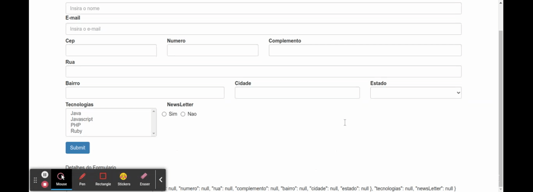

# Radio Button

Os campos do tipo radio button permitem que apenas uma opcao seja selecionada, se outra opcao for selecionada, a opcao anterior e desconsiderada. para este exemplo iremos utilizar os [radio buttons](https://getbootstrap.com/docs/3.3/css/#forms-controls) do [bootstrap 3](https://getbootstrap.com/docs/3.3/).

Os dados utilizados no exemplo estao mockados em um array de objetos que correspondem as opcoes que sarao exibidas (tambem e possivel declaras as opcoes hard coded diretamente no template HTML).

```typescript
import { HttpClient } from '@angular/common/http';
import { Component, OnInit } from '@angular/core';
import { FormBuilder, FormGroup, Validators } from '@angular/forms';
import { map } from 'rxjs/operators';
import { DadosService } from '../../../shared/dropdown/dados.service';
import { EstadoBr } from './../../../../assets/dados/estados/estados.model';
import { CepService } from './../../../shared/cep/cep.service';

@Component({
  selector: 'app-data-driven-form',
  templateUrl: './data-driven-form.component.html',
  styleUrls: ['./data-driven-form.component.css']
})
export class DataDrivenFormComponent implements OnInit {

  // ...demais atributos
  public newsLetterOptions: any[] = this.getNewsLetter()

  constructor(private formBuilder: FormBuilder, private http: HttpClient, private dadosService: DadosService, private cepService: CepService) { }

  ngOnInit(): void {
    this.formulario = this.formBuilder.group({
      nome: [null, Validators.required],
      email: [null, [Validators.required, Validators.email]],
      endereco: this.formBuilder.group({
        cep: [null, Validators.required],
        numero: [null, Validators.required],
        rua: [null, Validators.required],
        complemento: null,
        bairro: [null, Validators.required],
        cidade: [null, Validators.required],
        estado: [null, Validators.required]
      }),
      tecnologias: null,
      newsLetter: null
    })
    this.dadosService.getEstadosBr().subscribe(
      estados => this.estados = estados
    )
  }

  // ...demais metodos

  public getNewsLetter() {
    return [
      { valor: 's', desc: 'Sim' },
      { valor: 'n', desc: 'Nao' }
    ];
  }
}
```

no template HTML iremos utilizar a diretiva `ngFor` para renderezar as opcoes disponiveis no array `newsLetterOptions`.

```HTML
<form class="form-horizontal" [formGroup]="formulario" (ngSubmit)="onSubmit()">
  <div class="form-group">
    
    <!-- demais campos do formulario -->

    <div class="col-md-3" [ngClass]="aplicaCssErro('newsLetter')">
      <label for="newsLetter" class="control-label">NewsLetter</label>
      <div class="row" id="newsLetter">
        <label class="radio-inline" *ngFor="let option of newsLetterOptions">
          <input type="radio" name="inlineRadioOptions" formControlName="newsLetter" [value]="option.valor"/> {{ option.desc }}
        </label>
      </div>
    </div>
  </div>
  <button type="submit" class="btn btn-primary">Submit</button>
</form>
<app-form-debug [formulario]="formulario"></app-form-debug>
```

<p align="center">
  <br>
    selecionando multiplos valores no combobox multiplo.
</p>

## Declarando opcoes hard coded

Exemplo de declaracao das opcoes do formulario hard coded, Lembre-se que neste caso todos as tag `input` necessitam do atributo `formControlName` para poder identificar a qual `FormControl` pertencem.

```HTML
```HTML
<form class="form-horizontal" [formGroup]="formulario" (ngSubmit)="onSubmit()">
  <div class="form-group">
    
    <!-- demais campos do formulario -->

    <div class="col-md-3" [ngClass]="aplicaCssErro('newsLetter')">
      <label for="newsLetter" class="control-label">NewsLetter</label>
      <div class="row" id="newsLetter">
        <label class="radio-inline">
          <input type="radio" name="inlineRadioOptions" formControlName="newsLetter" value="s"/> Sim
        </label>
        <label class="radio-inline" *ngFor="let option of newsLetterOptions">
          <input type="radio" name="inlineRadioOptions" formControlName="newsLetter" value="n"/> Nao
        </label>
      </div>
    </div>
  </div>
  <button type="submit" class="btn btn-primary">Submit</button>
</form>
<app-form-debug [formulario]="formulario"></app-form-debug>
```
