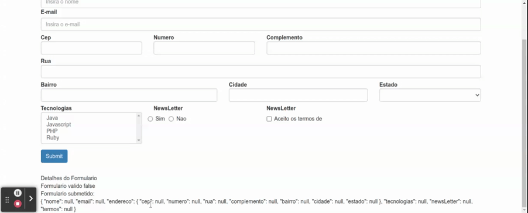

## Checkbox Toggle

O checkbox toggle assume os valores "true" quando esta marcado e "false" quando desabilitado, para relizar a validacao e possivel utilizar o `Validator` `pattern` do angular, pois, neste caso temos certeza que apenas este dois valores serao retornados (se nenhum valor for inicializado como padrao o valor incial sera "null").

Neste exemplo iteremos criar um campo de aceite as termos de uso.

Adicionando o `FormControl` ao objeto passado como argumento para o metodo `group` do `FormBuilder`.

```typescript

// ...imports

@Component({
  selector: 'app-data-driven-form',
  templateUrl: './data-driven-form.component.html',
  styleUrls: ['./data-driven-form.component.css']
})
export class DataDrivenFormComponent implements OnInit {

  // ...atributos

  constructor(private formBuilder: FormBuilder, private http: HttpClient, private dadosService: DadosService, private cepService: CepService) { }

  ngOnInit(): void {
    this.formulario = this.formBuilder.group({
      nome: [null, Validators.required],
      email: [null, [Validators.required, Validators.email]],
      endereco: this.formBuilder.group({
        cep: [null, Validators.required],
        numero: [null, Validators.required],
        rua: [null, Validators.required],
        complemento: null,
        bairro: [null, Validators.required],
        cidade: [null, Validators.required],
        estado: [null, Validators.required]
      }),
      tecnologias: null,
      newsLetter: null,
      // novo FormControl adicionado
      termos: [null, Validators.pattern('true')],
    })
    this.dadosService.getEstadosBr().subscribe(
      estados => this.estados = estados
    )
  }

  public aplicaCssErro(nomeCampo: string) {
    return {
      'has-error': this.verificaValidAndTouched(nomeCampo),
      'has-feedback': this.verificaValidAndTouched(nomeCampo)
    }
  }

  // ...demais metodos
}
```

No template HTML o checkbox e adcionado conforma a estrutura descrita na documentacao [horizontal forms](https://getbootstrap.com/docs/3.3/css/#forms-horizontal) do [Bootstrap 3]() e o css de validacao aplicado conforme a secao [validation status](https://getbootstrap.com/docs/3.3/css/#forms-control-validation)

```HTML
<form class="form-horizontal" [formGroup]="formulario" (ngSubmit)="onSubmit()">
  <div class="form-group">
    
    <!-- demais campos do formulario -->

    <div class="col-md-3" [ngClass]="aplicaCssErro('termos')">
    <label for="newsLetter" class="control-label">Termos</label>
      <div class="checkbox">
        <label>
          <input type="checkbox" id="blankCheckbox" formControlName="termos"> Aceito os termos
        </label>
      </div>
    </div>
  </div>
  <button type="submit" class="btn btn-primary">Submit</button>
</form>
<app-form-debug [formulario]="formulario"></app-form-debug>
```

<p align="center">
  <br>
    checkbox toggle.
</p>
