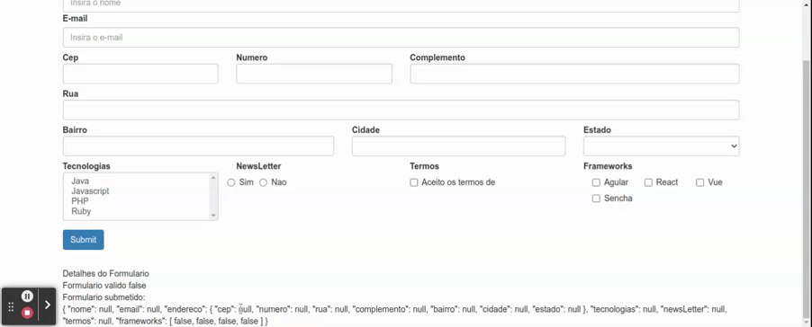

# FormArray: checkboxes dinamicos

Para este exemplo iremos utilizar um array com dados mockados para exemplificar o cenario. Ao trabalhar com multiplos valores para um mesmo campo o Angular possui uma classe especifica para auxiliar o gerenciamento dos dados, `FormArray` pode ser utilizado tanto para checkboxes dinamicos quanto para formularios aninhados.

Existem diversas formas de realizar a declaracao de um `FormArray`, vamos utilizar o exemplo mais comum na comunidade de desenvolvimento, que consiste na declaracao de um objeto do tipo `FormArray` separadamento e em seguida a inclusao no formulario principal.

```typescript
// ...imports

@Component({
  selector: 'app-data-driven-form',
  templateUrl: './data-driven-form.component.html',
  styleUrls: ['./data-driven-form.component.css']
})
export class DataDrivenFormComponent implements OnInit {

  // ...demais atributos
  public frameworks = ['Agular', 'React', 'Vue', 'Sencha'];

  constructor(private formBuilder: FormBuilder, private http: HttpClient, private dadosService: DadosService, private cepService: CepService) { }

  ngOnInit(): void {
    this.formulario = this.formBuilder.group({
      nome: [null, Validators.required],
      email: [null, [Validators.required, Validators.email]],
      endereco: this.formBuilder.group({
        cep: [null, Validators.required],
        numero: [null, Validators.required],
        rua: [null, Validators.required],
        complemento: null,
        bairro: [null, Validators.required],
        cidade: [null, Validators.required],
        estado: [null, Validators.required]
      }),
      tecnologias: null,
      newsLetter: null,
      termos: [null, Validators.pattern('true')],
      frameworks: this.buildFormArray() // chamada do metodo para obter o FormArray
    })
    this.dadosService.getEstadosBr().subscribe(
      estados => this.estados = estados
    )
  }

  // ...metodo para construir o FormArray
  public buildFormArray() {
    const values = this.frameworks.map(framework => new FormControl(false));
    return this.formBuilder.array(values);
  }

}
```

para realizar o link entre o template HTML e o formulario data driven utilizaremos a diretiva `formArrayName` do angular que ira indicar o `FormArray` no interior do `FormGroup`, alem disso e importante observar que os array e apenas um conjunto de `FormControl` inicializado com o valor false, logo para exibir o nome dos frameworks na tela iremos utilizar o proprio array que contem os valores (neste exemplo `this.framaworks[i]`) pegando cada elemento atraves do indice, e para realizar o link com o elemento correspondente do `FormArray`, para a diretiva `formControlName` e passado o indice do `FormControl` no interior do `FormArray`.

```HTML
<form class="form-horizontal" [formGroup]="formulario" (ngSubmit)="onSubmit()">
  <div class="form-group">
    
    <!-- demais campos do formulario -->

    <div class="col-md-3" [ngClass]="aplicaCssErro('frameworks')">
      <div id="frameworks">
        <label for="frameworks" class="control-label">Frameworks</label>
        <div id="frameworks">
          <div class="checkbox col-sm-4" formArrayName="frameworks" *ngFor="let control of getFrameworksControls(); let i = index">
            <label>
              <input type="checkbox" [formControlName]="i"> {{ this.frameworks[i] }}
            </label>
          </div>
        </div>
      </div>
    </div>
  </div>
  <button type="submit" class="btn btn-primary">Submit</button>
</form>
<app-form-debug [formulario]="formulario"></app-form-debug>

```


<p align="center">
  <br>
    checkboxes dinamicos com FormArray.
</p>

