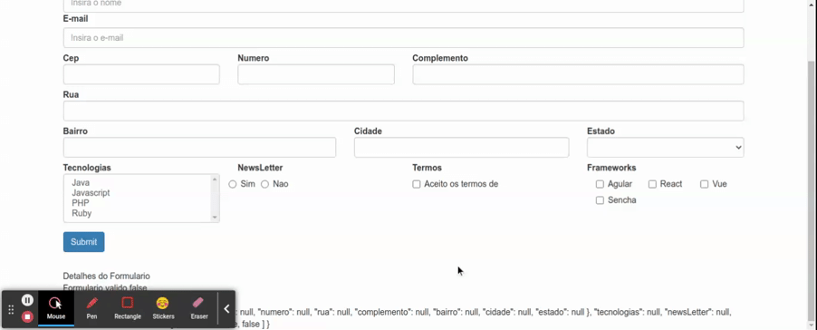

# Validacao Customizada em FormArray

Em form arrays os validadores do angular da classe `Validators` tambem sao aplicaveis, porem vamos imaginar que seja necessario validar se o usuario selecionou ao menos um checkbox, neste caso nao ha um validador que realize essa verificacao, neste exemplo iremos ver como implementa-la.

para realizar a validacao da quantidade de campos selecionada e necessario criar uma funcao que ira verificar a quantidade de campos marcados como verdadeiro no `FormArray`, podemos utilizar programacao funcionao e passar a funcao declarada para o motodo `array` do `FormBuilder`.

```typescript
import { HttpClient } from '@angular/common/http';
import { Component, OnInit } from '@angular/core';
import { FormArray, FormBuilder, FormControl, FormGroup, ValidatorFn, Validators } from '@angular/forms';
import { map } from 'rxjs/operators';
import { DadosService } from '../../../shared/dropdown/dados.service';
import { EstadoBr } from './../../../../assets/dados/estados/estados.model';
import { CepService } from './../../../shared/cep/cep.service';

@Component({
  selector: 'app-data-driven-form',
  templateUrl: './data-driven-form.component.html',
  styleUrls: ['./data-driven-form.component.css']
})
export class DataDrivenFormComponent implements OnInit {

  public formulario: FormGroup;
  public estados: EstadoBr[];
  public tecnologias: any[] = this.getTecnologias();
  public newsLetterOptions: any[] = this.getNewsLetter();
  public frameworks = ['Agular', 'React', 'Vue', 'Sencha'];

  constructor(private formBuilder: FormBuilder, private http: HttpClient, private dadosService: DadosService, private cepService: CepService) { }

  ngOnInit(): void {
    this.formulario = this.formBuilder.group({
      nome: [null, Validators.required],
      email: [null, [Validators.required, Validators.email]],
      endereco: this.formBuilder.group({
        cep: [null, Validators.required],
        numero: [null, Validators.required],
        rua: [null, Validators.required],
        complemento: null,
        bairro: [null, Validators.required],
        cidade: [null, Validators.required],
        estado: [null, Validators.required]
      }),
      tecnologias: null,
      newsLetter: null,
      termos: [null, Validators.pattern('true')],
      frameworks: this.buildFormArray()
    })
    this.dadosService.getEstadosBr().subscribe(
      estados => this.estados = estados
    )
    console.log(this.formulario.get('frameworks'));

  }

  public buildFormArray(): FormArray {
    const values = this.frameworks.map(framework => new FormControl(false));
    // passagem do validator para o motodo array
    return this.formBuilder.array(values, this.requiredMinCheckbox());
  }

  // ...demais metodos

  // a variavel validator armazena a arrow function que sera utilizada para realizar a validacao da quantidade minima selecionada no form array.
  public requiredMinCheckbox(min = 1): ValidatorFn {
    const validator = (formulario: FormArray) => {
      const totalChecked = formulario.controls.filter(control => control.value == true).length;
      if(totalChecked < min) return { required: true }
      return null;
    };
    return <ValidatorFn> validator
  }
}
```

No template HTML basta apenas adicionar os campo de erro e utilizar o metodo aplicaCssErro caso o `frameworks`, no interior do `FormGroup` principal seja invalido.

```HTML
<form class="form-horizontal" [formGroup]="formulario" (ngSubmit)="onSubmit()">
  <div class="form-group">
    
    <!-- adicionado campo de erro e chamada para o metodo aplicaCssErro -->

    <div class="col-md-3" [ngClass]="aplicaCssErro('frameworks')">
      <div id="frameworks">
        <label for="frameworks" class="control-label">Frameworks</label>
        <div id="frameworks">
          <div class="checkbox col-sm-4" formArrayName="frameworks" *ngFor="let control of getFrameworksControls(); let i = index">
            <label>
              <input type="checkbox" [formControlName]="i"> {{ this.frameworks[i] }}
            </label>
          </div>
          <app-campo-erro [mostrarErro]="verificaValidAndTouched('frameworks')"
            mensagemErro="selecione pelo menos 1 checkbox">
          </app-campo-erro>
        </div>
      </div>
    </div>
  </div>
  <button type="submit" class="btn btn-primary">Submit</button>
</form>
<app-form-debug [formulario]="formulario"></app-form-debug>

```

<p align="center">
  <br>
    validacao customizada em FormArray.
</p>
