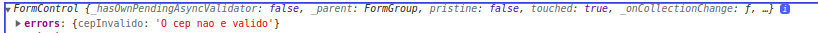
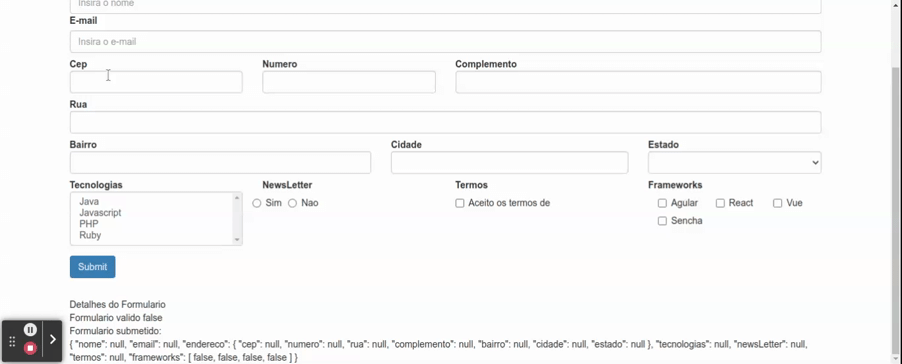

## Validacao Customizada

Para implementar validacoes personalizadas e possivel declarar metodos que contem em sua assinatura um parametro do tipo `FormControl` (deste modo o angular identifica e injeta o control automaticamente ao receber este validator como valor no array declarado para o respectivo campo no metodo `group` da classe `FormBuilder`). Para este exemplo sera aplicada uma validacao customizada ao campo cep. note que neste caso nao contemos parametros alem do proprio `FormControl`, vide [Validacao Customizada em FormArray](21-validacao-customizada-cep.md) para declarar metodos que podem receber parametros de validacao. 

o metodo declarado e `validarCep` que recebe um parametro do tipo `FormControl`, no interior do metodo contem a logica para validar se o valor e valido ou nao, retornando objeto contendo o erro, caso invalido, e possivel passar o valor true para a chave com o nome do erro (neste caso cepInvalido) ou uma mensagem.

```typescript
public validarCep(formControl: FormControl) {
    const cep = formControl.value;
    if(cep && cep !== '') {
      const regexCep = /^[0-9]{8}$/;
      return regexCep.test(cep) ? null : {cepInvalido: 'O cep nao e valido' }
    }
    return null;
  }
```

no array que espera receber os validators, basta, incluir a validacao customizada ao array.

```typescript
is.formulario = this.formBuilder.group({
nome: [null, Validators.required],
email: [null, [Validators.required, Validators.email]],
endereco: this.formBuilder.group({
  // validator customizado adicionado aos validators do formControl.
  // note que nao e necessario passar o `FormControl` como argumento,
  // pois o angular entende e injeta-o como argumento automaticamente
  cep: [null, [Validators.required, this.validarCep]],
  numero: [null, Validators.required],
  rua: [null, Validators.required],
  complemento: null,
  bairro: [null, Validators.required],
  cidade: [null, Validators.required],
  estado: [null, Validators.required]
}),
tecnologias: null,
newsLetter: null,
termos: [null, Validators.pattern('true')],
frameworks: this.buildFormArray()
    })
```

Deste modo ao digitar um cep que nao esteja valido o atributo `errors` dentro do control ira conter o erro retornado.

<p align="center">
  <br>
    objetos contendo erros no FormControl de cep.
</p>

## Exibindo erros personalizados.

as mensagens no interior de errors podem ser capturadas para exibicao ao usuario ou tratativa em outros algoritmos, note que neste exemplo iremos utilizar o um component para exibir a mensagem de erro, e utilizando o metodo `hasError` da propria classe `FormControl` verificamos se a `div` que contem o erro deve ou nao ser exibida.

```HTML
<div class="col-md-3" [ngClass]="aplicaCssErro('endereco.cep')">
  <label for="cep" class="control-label">Cep</label>
  <input type="text" class="form-control" id="cep" formControlName="cep" (blur)="consultaCep()" />
  <app-campo-erro [mostrarErro]="verificaValidAndTouched('endereco.cep')"
    mensagemErro="O campo cep e obrigatorio">
  </app-campo-erro>
  <app-campo-erro [mostrarErro]="this.formulario.get('endereco.cep')?.hasError('cepInvalido')"
    [mensagemErro]="this.formulario.get('endereco.cep')?.errors?.cepInvalido">
  </app-campo-erro>
</div>
```
<p align="center">
  <br>
    validacao customizada no campo cep.
</p>


