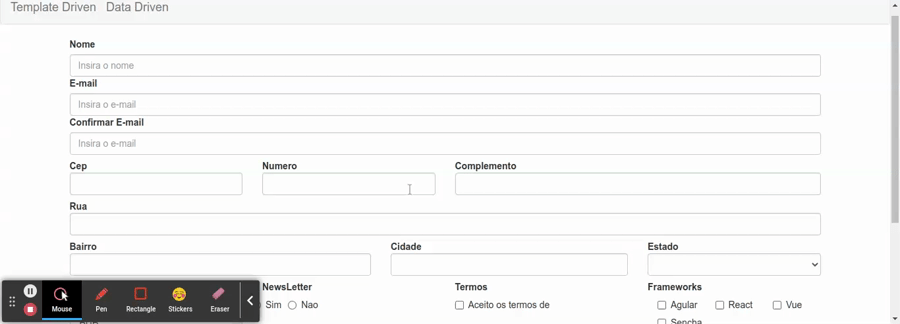

# Validacao entre dois campos

E possivel relacionar dois campos para realizar validacoes, para este exemplo serao relacionados o campo email e confirmar email.

neste caso sera necessario passar como argumento o nome do outro campor do formulario ao qual queremos realizar a comparacao, logo nosso metodo de validacao espera receber um argumento alem do proprio `formControl` ao qual vai aplicar a validacao, e para estes casos e necessario retornar a funcao de validacao.

a classe `ValidaService` cotem metodos especificos para validacoes.

```typescript
import { FormControl, FormGroup } from '@angular/forms';

export class ValidaService {

  public static equalsTo(otherField: string) {
    const validator = (formControl: FormControl) => {
      if(otherField == null || otherField == '') {
        throw new Error('E necessario um campo valido para comparacao');
      }
      const value = formControl.value;
      const otherValue = (<FormGroup>formControl.root).get(otherField)?.value;
      return value != otherValue ? { notEquals: otherField } : null;
    }
    return validator;
  }
}
```

```typescript
this.formulario = this.formBuilder.group({
      nome: [null, Validators.required],
      email: [null, [Validators.required, Validators.email]],
      // aplicando o metodo equalsTo da classe ValidaService como validator para o campo confirmacaoEmail e comparando com o campo email.
      confirmarEmail: [null, [Validators.required, Validators.email, ValidaService.equalsTo('email')]],
      endereco: this.formBuilder.group({
        cep: [null, [Validators.required, this.validarCep]],
        numero: [null, Validators.required],
        rua: [null, Validators.required],
        complemento: null,
        bairro: [null, Validators.required],
        cidade: [null, Validators.required],
        estado: [null, Validators.required]
      }),
      tecnologias: null,
      newsLetter: null,
      termos: [null, Validators.pattern('true')],
      frameworks: this.buildFormArray()
    })
```
<p align="center">
  <br>
    validacao entre dois campos.
</p>

entretando esse tipo de validacao e comum e existem bibliotecas especificas desenvolvidas pela comunidade para lidar com esses tipos de validacoes mais comums, como o [ng2-validation](https://www.npmjs.com/package/ng2-validation).
