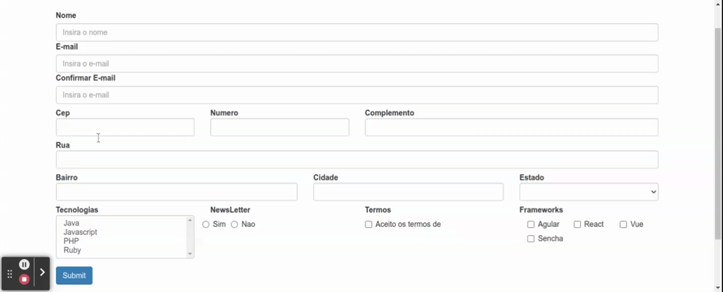

# Centralizando mensagens de Erros

Ao longo do desenvolvimento de um projeto e interessante que as mensagens exibidas na aplicacao possuam uma padronizacao, para que a consistencia seja mantida em diferentes telas, para o usuario esta e uma caracteristica muito importante acerca da user experience - UX -, entretando, pode ser dificil manter todos os campos da mesma forma em projetos que diversos desenvolvedores atuam simultaneamente, para solucionar esta questao e interesante criar centralizar determinadas funcionalidades, deste modo todos os desenvolvedores podem utilizar o mesmo servico e obter resultados padronizados, alem de evitar a duplicacao de codigo. Neste exemplo iremos criar um _component_ responsavel pelas mensagens de validacao de erros.

O primeiro passo e declarar a estrutura do component

```HTML
<div *ngIf="errorMesage">
  <div class="alert alert-danger" role="alert">{{ errorMesage }}</div>
</div>
```

```typescript
import { Component, Input } from '@angular/core';
import { AbstractControl } from '@angular/forms';
import { ValidaService } from './../../services/valida.service';

@Component({
  selector: 'app-error-mesage',
  templateUrl: './error-mesage.component.html',
  styleUrls: ['./error-mesage.component.css']
})
export class ErrorMesageComponent {

  @Input() control: AbstractControl | null;
  @Input() label: string;

  get errorMesage() {
    for(const propertyName in this.control.errors) {
      if(
        this.control.errors.hasOwnProperty(propertyName) &&
        this.control.touched
      ) {
        return ValidaService.getErrorMesage(this.label, propertyName, this.control.errors[propertyName])
      }
    }
    return null;
  }
}
```

note que os inputs, esperam receber o nome da label do compoenent e seu control, e o metodo get `errorMesage` contem a logica necessaria para obter a respectiva mensagem de acordo com o erro de validacao.

na classa `ValidaService` temos um metodo estatico responsavel por conter as mensagens de erro, caso a mensagem esteja contida no array ela e retornada.

```typescript
import { FormControl, FormGroup } from '@angular/forms';

export class ValidaService {

  public static equalsTo(otherField: string) {
    const validator = (formControl: FormControl) => {
      if(otherField == null || otherField == '') {
        throw new Error('E necessario um campo valido para comparacao');
      }
      const value = formControl.value;
      const otherValue = (<FormGroup>formControl.root).get(otherField)?.value;
      return value != otherValue ? { notEquals: otherField } : null;
    }
    return validator;
  }

  public static getErrorMesage(fieldName: string, validatorName: string, validatorValue?: any) {
    const config = {
      'required': `${fieldName} e obrigatorio`,
      'minlength': `${fieldName} necessita ter no minimo ${validatorValue.requiredLength}`,
      'maxlength': `${fieldName} necessita ter no maximo ${validatorValue.requiredLength}`,
      'cepInvalido': 'cep invalido',
    }
    return config[validatorName];
  }
}
```

<p align="center">
  <br>
    centralizacao das validacoes em unico component.
</p> 
