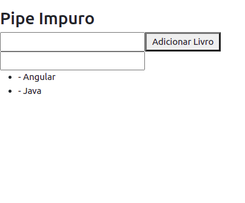
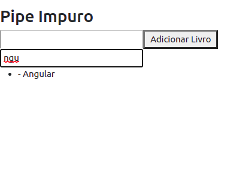
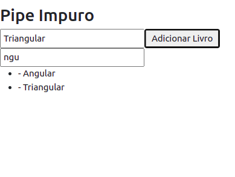

# __CRIANDO PIPE IMPURO__

OBS: por questoes de performace o time do Angular recomenda que nao sejam implementados pipes para realizar a filtragem em arrays e ordenacao de elementos, iremos implemetar apenas a nivel de exemplo para entender o conceito, porem nao deve ser implementado em projetos em producao, implementar as funcionalidades citadas anteriormente deve-se declarar diretamente no codigo (vide [MANEIRA CORRETA DE ADICIONAR FILTRO NOS PROJETOS](maneira-correta-de-adicionar-filtro-nos-projetos.md)).

vamos criar um filtro para array similar ao exemplo visto em [CRIANDO UM PIPE PURO](criando-pipe-puro.md), e utilizar os conceitos de heranca para herdar a interface PipeTransform da classe pipe criada anteriormente.

para tornar o pipe impuro, (para que ele escute as mudancas no argumento passado ao parametro), basta adcionar o meta-dado `pure` e setar como `false`, por padrao este meta-dado e setado como `true`.

___Pipe_:__
```typescript
import { Pipe } from '@angular/core';

import { PipePuroPipe } from './../criando-pipe-puro/pipe-puro.pipe';

@Pipe({
  name: 'filtroArrayImpuro',
  pure: false // meta-dado para tornar o pipe impuro
})
export class PipeImpuroPipe extends PipePuroPipe {

  transform(value: any, ...args: any[]): any {
    if(value.lenght === 0 || args === undefined){
      return value
    }
    
    let filro = args.toLocaleString().toLocaleLowerCase()
    
    return value.filter(
      (elementoASerComparado: string) => elementoASerComparado.toLocaleLowerCase().includes(filro)
    );
  }
}
```
___Component__:_
```typescript
import { Component, OnInit } from '@angular/core';

@Component({
  selector: 'app-pipe-impuro',
  templateUrl: './pipe-impuro.component.html',
  styleUrls: ['./pipe-impuro.component.css']
})
export class PipeImpuroComponent implements OnInit {

  livros: string[] = ['Angular', 'Java']

  filtro: any

  constructor() { }

  ngOnInit(): void {
  }

  addLivro(novoLivro: string){
    this.livros.push(novoLivro)
    console.log(this.livros)
  }

}
```
___Template_ do _Component_:__

```HTML
<div>
    <h3>Pipe Impuro</h3>
    <div>
        <input #inputLivro>
        <button (click)="addLivro(inputLivro.value)">Adicionar Livro</button>
    </div>
    <div>
        <input [(ngModel)]="filtro">
    </div>
    <ul>
        <li *ngFor="let livro of livros | filtroArrayImpuro:filtro">
            - {{ livro }}
        </li>
    </ul>
</div>
```
<p align="center">
    <br>
    figura 1 - pipe impuro ao ser renderizado primeira vez
</p>

ao aplicar o filtro

<p align="center">
    <br>
    figura 2 - pipe impuro ao aplicar o filtro
</p>

ao adcionar um novo elemento ao array com o filtro aplicado, note que a lista e atualizada.

<p align="center">
    <br>
    figura 3 - pipe impuro ao adcionar novo elemento com o filtro (pipe) aplicado.
</p>

