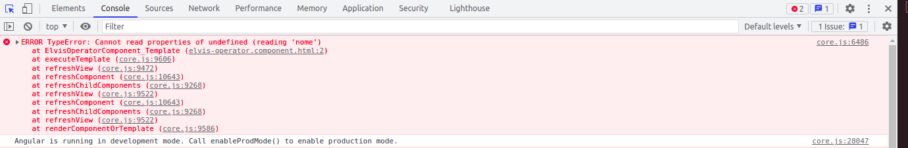

# Elvis operator

Elvis operator tambem e conhecido como operador que fornece navegacao segura entre os objetos. Para entender a relevancia na utilizacao, vamos entender a situacao problema. inicialmente temos a declaracao do objeto tarefa e em seu interior temos desc (descricao) e responsavel.

```typescript
import { Component, OnInit } from '@angular/core';

@Component({
  selector: 'app-elvis-operator',
  templateUrl: './elvis-operator.component.html',
  styleUrls: ['./elvis-operator.component.css']
})
export class ElvisOperatorComponent implements OnInit {

  tarefa: any = {
    desc: 'Descricao da tarefa',
    resposavel: null
    /* responsavel: {
        nome: 'insira o nome'
        data: 'insira a data'
    }*/
  }

  constructor() { }

  ngOnInit(): void {
  }
}
```
note que o valor de responsavel e inicializado como nulo, porem ele pode receber qualquer tipo de dado inclusive outro objeto contendo outros atributos em seu interior.
Vamos tentar acessar uma propriedade no interior de responsavel por meio de interpolacao no template e verificar o comportamento.

```HTML
<p>{{ tarefa.desc }}</p>
<p>{{ tarefa.responsavel.nome }}</p>
```
apesar de 2 paragrafos declarados, apenas o primeiro sera exibido, pois responsavel teve seu valor inicializado como null (nulo).


e no console, recebemos a mensagem de que nao e possivel acessar a propriedade nome pois responsavel e undefined ou seja indefinido.



para evitar esse problema uma solucao seria utilizar o operador ternario.

```HTML
<p>{{ tarefa.desc }}</p>
<p>{{ tarefa.responsavel != null ? tarefa.responsavel.nome : ''}}</p>
```
porem note a quantidade de codigo necessario, em casos onde temos arvores maiores de objetos a complexidade torna-se cada vez maior.

o elvis operator realiza a mesma logica que o operador ternario implementado acima, caso responsavel nao seja nulo, ele ira acessar o propriedade e caso seja nulo retornara o valor vazio (''), basta incluir ? apos o identificador que pode vir a receber um valor nulo.

```HTML
<p>{{ tarefa.desc }}</p>
<p>{{ tarefa.responsavel?.nome}}</p>
```
