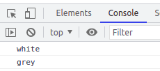

# Diretivas com Input e PropertyBinding

vamos aplicar os conceitos de InputProperty e PropertyBinding na criacao de diretivas, para tal vamos utilizar o exemplo feito anteriormente sobre o topico HostListener e HostBinding. para tonar as cores do highLight variaveis. segue abaixo o exemplo sem modificacoes.

```typescript
import { Directive, HostListener, HostBinding } from '@angular/core';

@Directive({
  selector: '[highLightMouse]'
})
export class HighLightMouseDirective {

  @HostBinding('style.backgroundColor') backgroundColor: string

  constructor() { 
    this.backgroundColor = ''
  }

  @HostListener('mouseenter') onMouseOver(){
    this.backgroundColor = 'yellow'
  }

  @HostListener('mouseleave') onMouseLeave(){
    this.backgroundColor = ''
  }

}
```

vamos implementar a classe Input em duas variaveis, a primeira, defaultColor, ira receber a cor quando o mouse nao estiver sobre o objeto, a segunda, highLightColor, ira receber a cor quando o mouse estiver sobre o objeto. Os dados serao recebidos por meio de propertyBinding.

```typescript
@Directive({
  selector: '[DiretivasComInputEPropertyBinding]'
})
export class DiretivasComInputEPropertyBindingDirective {

  @HostBinding('style.backgroundColor') backgroundColor: string = ''
  @Input() defaultColor: string = 'white'
  @Input() highLightColor: string = 'yellow'

  constructor() { }

  @HostListener('mouseenter') onMouseOver(){
    this.backgroundColor = this.highLightColor
  }

  @HostListener('mouseleave') onMouseLeave(){
    this.backgroundColor = this.defaultColor
  }
}
```
neste exemplo na primeira renderizacao do component ele ira possuir o fundo brando, pois inicialmente, como nao ocorreram eventos sobre o component Host (component Pai, neste exemplo a tag p), os metodos onMouseOver() e onMouseLeave() nao foram chamados.

```HTML
<p DiretivasComInputEPropertyBinding [defaultColor]="'grey'" [highLightColor]="'red'">
    texto com highLight com cores customizadas
</p>
```
OBS: note que o angular possui inteligencia para detectar que o propertyBinding e referente a diretiva e nao a tag p.

elemento na primeira renderizacao, com o valor padrao para o background<br>


elemento ao passar o mouse, a diretiva escuta o evento mouseover e chama o metodo onMouseOver()<br>


elemento ao retirar o mouse, a diretiva escuta o evento mouseleave e chama o metodo onMouseLeave()<br>


para que a primeira renderizacao do elemento atribua o valor de defaultColor recebido por meio de propertyBinding para a variavel backgoundColor, podemos utilizar metodo onInit() (metodos do ciclo de vida, lifeHooks, podem ser utilizados em diretivas, possuem o mesmo comportamento).

```typescript
import { Directive, HostBinding, HostListener, Input, OnInit } from '@angular/core';

@Directive({
  selector: '[DiretivasComInputEPropertyBinding]'
})
export class DiretivasComInputEPropertyBindingDirective implements OnInit  {

  @HostBinding('style.backgroundColor') backgroundColor: string 
  @Input() defaultColor: string = 'white'
  @Input() highLightColor: string = 'yellow'

  constructor() { }

  ngOnInit(): void {
    this.backgroundColor = this.defaultColor
  }

  @HostListener('mouseenter') onMouseOver(){
    this.backgroundColor = this.highLightColor
  }

  @HostListener('mouseleave') onMouseLeave(){
    this.backgroundColor = this.defaultColor
  }
}
```
## Duvida Comum (resposta)
uma duvida recorrente, poderiamos atribuir o valor da variavel defaultColor para a variavel backgroundColor no metodo construtor() e manter o mesmo comportamento ?, a resposta e nao, pois a atribuicao dos valores por meio de propertyBinding e feita depois da construcao do objeto (ou seja, no momento da criacao do objeto, os valores ainda sao os padroes atribuidos na classe, white e yellow, para defaultColor e highLightColor respectivamente), vamos exemplificar utilizando o console, basta exibir os valor de backgroundColor em ambos os metodos.

```typescript
import { Directive, HostBinding, HostListener, Input, OnInit } from '@angular/core';

@Directive({
  selector: '[DiretivasComInputEPropertyBinding]'
})
export class DiretivasComInputEPropertyBindingDirective implements OnInit  {

  @HostBinding('style.backgroundColor') backgroundColor: string 
  @Input() defaultColor: string = 'white'
  @Input() highLightColor: string = 'yellow'

  constructor() { 
    this.backgroundColor = this.defaultColor
    console.log(backgroundColor) //mostra o valor atribuido no momento da construcao
  }
  
  ngOnInit(): void {
    this.backgroundColor = this.defaultColor
    console.log(backgroundColor) // mostra o valor atribuido apos a construcao
  }

  @HostListener('mouseenter') onMouseOver(){
    this.backgroundColor = this.highLightColor
  }

  @HostListener('mouseleave') onMouseLeave(){
    this.backgroundColor = this.defaultColor
  }
}
```
note que no metodo construtor() o valor atribuido a variavel backgroundColor e white, e no metodo onInit() o valor grey foi atribuido.<br>


## Melhoria de Codigo
Uma maneira de reduzir a quantidade de codigo necessario para implementar esta mesma funcionalidade seria passar como argumento para um dos metadados @Input o mesmo valor do selector da diretiva, desta forma a inteligencia do angular tambem consegue detectar que as InputProperty sao referentes a diretiva.

```typescript
import { Directive, HostBinding, HostListener, Input, OnInit } from '@angular/core';

@Directive({
  selector: '[DiretivasComInputEPropertyBinding]'
})
export class DiretivasComInputEPropertyBindingDirective implements OnInit  {

  @HostBinding('style.backgroundColor') backgroundColor: string 
  @Input() defaultColor: string = 'white'

  //@Input recebe como parametro o mesmo valor do selector da diretiva
  @Input('DiretivasComInputEPropertyBinding') highLightColor: string = 'yellow'

  constructor() { 
    this.backgroundColor = this.defaultColor
    console.log(backgroundColor)
  }
  
  ngOnInit(): void {
    this.backgroundColor = this.defaultColor
    console.log(backgroundColor)
  }

  @HostListener('mouseenter') onMouseOver(){
    this.backgroundColor = this.highLightColor
  }

  @HostListener('mouseleave') onMouseLeave(){
    this.backgroundColor = this.defaultColor
  }
}
```
deste modo nao e necessario declarar a diretiva diretamente no template pois sera feito um propertyBinding com o nome da diretiva.

```HTML
<p [DiretivasComInputEPropertyBinding]="'red'" [defaultColor]="'grey'">
    texto com highLight com cores customizadas
</p>
```