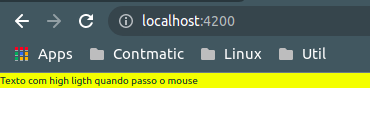

# HostListener e HostBinding

Para exemplificar a utilizacao de ambos, sarao criadas diretivas, lembrando que as diretivas sao divididas em estruturais e atributos. De modo geral as diretivas sao compartilhadas por toda a aplicacao, logo o ideal sera que estejam alocadas em um diretorio global para facilicar sua utilizacao como por exemplo criar um diretorio no interior de app (ex: app/shared), porem para fins deste exemplo serao alocadas no interior do diretorio _03-diretivas, pois o topico HostListener e HostBinding pertencem a este modulo do curso.

Vamos tomar como exemplo uma funcionalidade na qual ao passar o mouse sobre um elemento seu fundo sera alterado e ao retirar o mouse retorna a cor original.

ao passar mouse sobre<br>


ao retirar o mouse<br>


A diretiva deve ser declarada no elemento HTML

```HTML
<p highLightMouse>
    Texto com high ligth quando passo o mouse
</p>
```

## HostListener

Nos podemos utilizar a classe HostListener para escutar eventos oriundos do elemento HTML no qual a diretiva esta declarada, como HostListener e um meta-dado, em sua sintax utilizamos o decorator e a chamada do metodo conforme o exemplo.

```typescript
@HostListener('nome-do-evento') nomeDoMetodo(){
    //logica do metodo
}
```

deste modo quando o evento declarado como argumento no decorator ocorrer o metodo sera chamado, para auxiliar o exemplo de implementacao utilizaremos as classes ElementRef e Renderer2

```typescript
import { Directive, HostListener, ElementRef, Renderer2 } from '@angular/core';

@Directive({
  selector: '[highLightMouse]'
})
export class HighLightMouseDirective {

  constructor(private _elementRef: ElementRef, private _renderer: Renderer2) { }

  @HostListener('mouseenter') onMouseOver(){
     this._renderer.setStyle(
       this._elementRef.nativeElement,
       'background-color',
       'yellow'
     )
  }

  @HostListener('mouseleave') onMouseLeave(){
    this._renderer.setStyle(
      this._elementRef.nativeElement,
      'background-color',
      ''
    )
 }
}
```
## HostBinding

note no exemplo anterior os metodos onMouseOver() e onMouseLeave() possuem uma repeticao de codigo, existe uma forma mais compacta de implementar a mesma funcionalidade utilizando menos codigos, HostBiding em conjunto com o HostListerner. O hostBinding tambem e um meta-dado, porem recebe como argumento um atributo do elemento HTML no qual a diretiva esta declarada.

```typescript
@HostBinding('caminhoDoAtributo.nomeDoAtributo') nomeVariavel: tipoVariavel
```
implementando o HostListener para realizar a mesma funcionalidade temos o exemplo a seguir.

```typescript
import { Directive, HostListener, HostBinding } from '@angular/core';

@Directive({
  selector: '[highLightMouse]'
})
export class HighLightMouseDirective {

  @HostBinding('style.backgroundColor') backgroundColor: string

  constructor() { 
    this.backgroundColor = ''
  }

  @HostListener('mouseenter') onMouseOver(){
    this.backgroundColor = 'yellow'
  }

  @HostListener('mouseleave') onMouseLeave(){
    this.backgroundColor = ''
  }

}
```
note que nao e mais necessario utilizar as classes ElementRef e Renderer, e a variavel com meta dado @HostBinding necessita ter um valor inicializado, neste caso poderia ser inicializada diretamente na mesma linha de codigo, ou conforme o exemplo no construtor.
