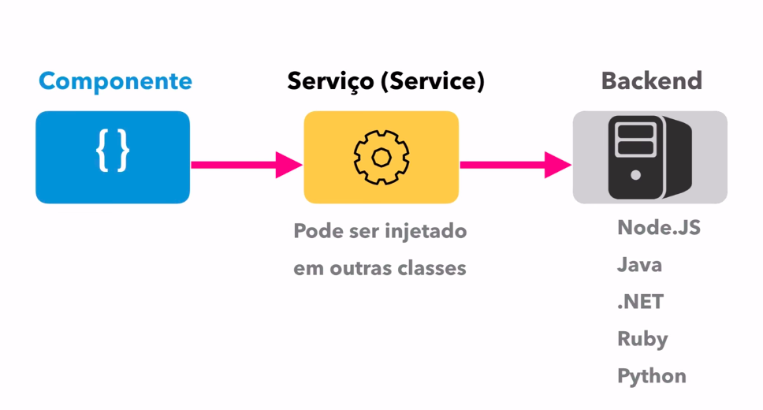
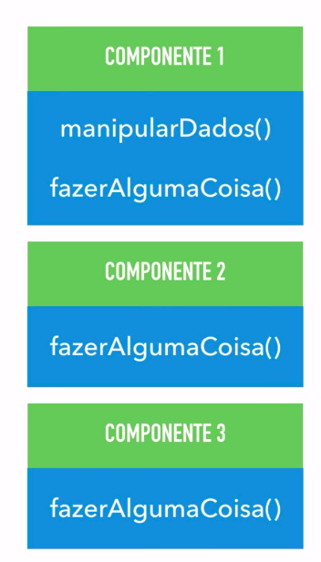
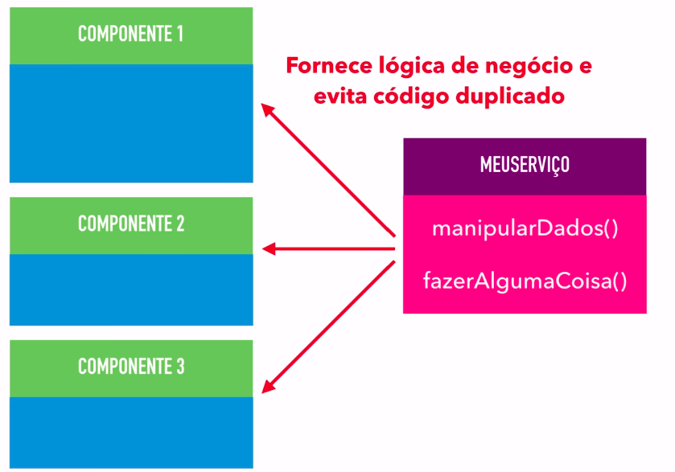

# Introducao a services

Os services sao classes auxiliares, sao em geral utilizados para fazer CRUD (Create, Read, Update, Delete) em dados no servidor, sao utilizadas para implementar a logica de negocios da aplicacao, deixando assim os components responsaveis apenas por exibir e capturar os dados.

    
     
    <h5 align="center">figura 1 - fluxo entre component, service e server</h5>

tambem podem ser utilizados para otimizar a codificacao quando mais de um component necessita fazer a mesma coisa um servico pode ser criado para isso, melhorando o processo de manutencao no futuro.

    
     
    <h5 align="center">figura 2 - classes com repeticao de codigo</h5>

     
    <h5 align="center">figura 3 - classes utilizando o service</h5>

Tambem podem ser utilizados como classes utilitarias, realizando traducoes, manipulacao e/ou verificacacao de dados etc.

