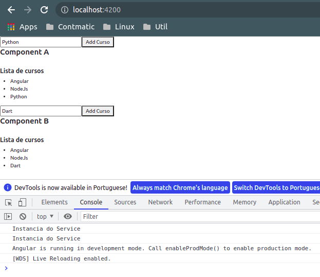

# __ESCOPO DE INSTANCIAS DE SERVICOS E MODULOS (SINGLETON x VARIAS INSTANCIAS)__
## __SINGLETON__
O conceito de singleton pode ser defindo como uma unica instancia de um servico estara disponivel para todo o escopo da aplicacao.

Para a implementacao da classe _service_ iremos utilizar o `console.log()` para exibir a mensagem `Instancia do Service`, ou seja, a cada nova instancia da classe `ServiceSingletonService` uma nova mensagem sera gerada no console (no caso da classe Singleton apenas uma instancia sera usada por varios _components_).

### __UTILIZANDO ATRIBUTO `providedIn`__

Nas versoes mais recentes do Angular, ao utilizar o objeto com atributo `providedIn: 'root'` como argumento do decorator `@Injectable()`, o _service_ fica disponivel para toda a aplicacao sem a necessidade de ser declarado em nenhum `_providers_`  (meta-dado) de modulo.

___service:___
```typescript
import { Injectable } from '@angular/core';

@Injectable({
  providedIn: 'root' // disponibiliza o service para o escopo global da aplicacao
})
export class ServiceSingletonService {

  constructor() { 
    console.log('Instancia do Service')
  }

  getCursos(){
    return ['Angular', 'NodeJs']
  }

  addCurso(curso: string){
    this.cursos.push(curso)
  }
}
```

### __ESCOPO DO SERVICE DEFINIDO NOS MODULOS__
Neste nao utilizamos nenhum argumento no decorator `@Injectable()`
```typescript
import { Injectable } from '@angular/core';

@Injectable()
export class ServiceSingletonService {

  cursos: string[] = ['Angular', 'NodeJs']

  constructor() { 
    console.log('Instancia do Service')
  }

  getCursos(){
    return ['Angular', 'NodeJs']
  }

  addCurso(curso: string){
    this.cursos.push(curso)
  }
}
``` 
o escopo do _service_ deve ser declarado nos respectivos modulos em 'providers' (meta-dado). Mesmo que declarado em mais de um modulo, apenas uma instancia do _service_ sera construida.

### __IMPLEMENTACAO DO SERVICE NOS COMPONENTS__

Como exemplo temos 2 components que irao utilizar um service por meio de injecao de dependencia.

___component_ A:__
```typescript
import { Component, OnInit } from '@angular/core';

// import do service
import { ServiceSingletonService } from '../service-singleton.service';

@Component({
  selector: 'app-component-a',
  templateUrl: './component-a.component.html',
  styleUrls: ['./component-a.component.css']
})
export class ComponentAComponent implements OnInit {

  cursos: string[] = []

  constructor(private cursosService: ServiceSingletonService) { }

  ngOnInit(): void {
    this.cursos = this.cursosService.getCursos()
  }

   onSalvarCurso(curso: string){
    this.cursosService.addCurso(curso)
  }
}
```
___template_ do _component_ A:__
```HTML
<div>
    <input type="text" #cursoInput>
    <button (click)="onSalvarCurso(cursoInput.value)">Add Curso</button>

    <h4> Component A</h4>
    <br>
    <h5>Lista de cursos</h5>
    <ul>
        <li *ngFor="let curso of cursos">
            {{ curso }}
        </li>
    </ul>
</div>
```
___component_ B:__
```typescript
import { Component, OnInit } from '@angular/core';

//import do service
import { ServiceSingletonService } from '../service-singleton.service';

@Component({
  selector: 'app-component-b',
  templateUrl: './component-b.component.html',
  styleUrls: ['./component-b.component.css']
})
export class ComponentBComponent implements OnInit {
  
  cursos: string[] = []

  constructor(private cursosService: ServiceSingletonService) { }

  ngOnInit(): void {
    this.cursos = this.cursosService.getCursos()
  }

   onSalvarCurso(curso: string){
    this.cursosService.addCurso(curso)
  }
}
```
___template_ do _component_ B:__
```HTML
<div>
    <input type="text" #cursoInput>
    <button (click)="onSalvarCurso(cursoInput.value)">Add Curso</button>
    
    <h4> Component B</h4>
    <br>
    <h5>Lista de cursos</h5>
    <ul>
        <li *ngFor="let curso of cursos">
            {{ curso }}
        </li>
    </ul>
</div>
```
note que as diferencas nos _components_ e _templates_ sao pequenas, pois possuem a mesma implementacao alternando apenas o nome da classe e os meta-dados do decorator `@Component()`.<br>

__Console:__
<p align="center">
    
    <br>
    <h5 align="center">figura 1 - Service Singleton</h5>
</p>

note que ambos os components foram renderizados, porem apenas uma mensagem foi emitida no log referente a instancia do serive e ao adicionar um novo curso em qualquer um dos campos ambas as listas irao exibilo, pois compartilham o mesmo _component_.

#
## __VARIAS INSTANCIAS__

Para que uma instancia de service seja acessado por um unico component (cada component possui sua respectiva instancia do _service_), basta declarar o `_providers_` (meta-dado), no decorator `@Component()`, vamos tomar o exemplo anterior alterando sua implementacao (os _templates_ e o _service_ permanecem iguais).

___component_ A:__
```typescript
import { Component, OnInit } from '@angular/core';

import { ServiceSingletonService } from '../service-singleton.service';

@Component({
  selector: 'app-component-a',
  templateUrl: './component-a.component.html',
  styleUrls: ['./component-a.component.css'],
  providers: [ServiceSingletonService] // instancia um service para o component A
})
export class ComponentAComponent implements OnInit {

  cursos: string[] = []

  constructor(private cursosService: ServiceSingletonService) { }

  ngOnInit(): void {
    this.cursos = this.cursosService.getCursos()
  }

   onSalvarCurso(curso: string){
    this.cursosService.addCurso(curso)
  }

}
```

___component_ B:__
```typescript
import { Component, OnInit } from '@angular/core';

import { ServiceSingletonService } from '../service-singleton.service';

@Component({
  selector: 'app-component-b',
  templateUrl: './component-b.component.html',
  styleUrls: ['./component-b.component.css'],
  providers: [ServiceSingletonService] // instancia um service para o component B
})
export class ComponentBComponent implements OnInit {
  
  cursos: string[] = []

  constructor(private cursosService: ServiceSingletonService) { }

  ngOnInit(): void {
    this.cursos = this.cursosService.getCursos()
  }

   onSalvarCurso(curso: string){
    this.cursosService.addCurso(curso)
  }
}
```
__Console:__
<p align="center">
    
    <br>
    <h5 align="center">figura 2 - Service varias instancias</h5>
</p>

note que 2 mensagens "Instancia do Service" foram emitidas pelo log, logo existe uma instancia respectiva a cada _component_ que possui sua propria lista de cursos individual.

