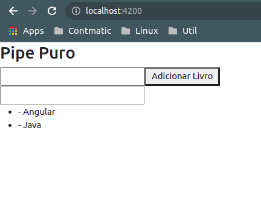
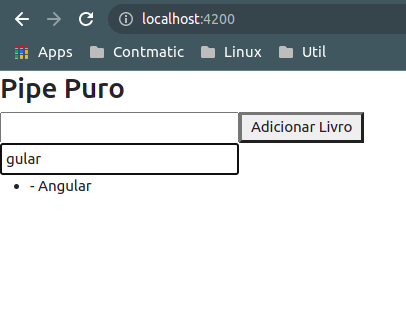
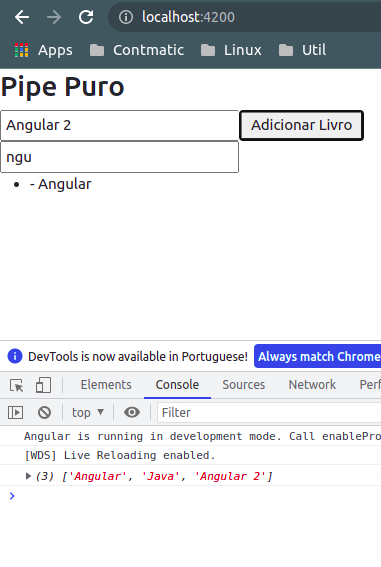

# __CRIANDO PIPE PURO__

OBS: por questoes de performace o time do Angular recomenda que nao sejam implementados pipes para realizar a filtragem em arrays e ordenacao de elementos, iremos implemetar apenas a nivel de exemplo para entender o conceito, porem nao deve ser implementado em projetos em producao, implementar as funcionalidades citadas anteriormente deve-se declarar diretamente no codigo (vide [MANEIRA CORRETA DE ADICIONAR FILTRO NOS PROJETOS](maneira-correta-de-adicionar-filtro-nos-projetos.md)).

Vamos criar um pipe para filtrar os elementos de um array.

___pipe:___

```typescript
import { Pipe, PipeTransform } from '@angular/core';

@Pipe({
  name: 'filtroArray'
})
export class PipePuroPipe implements PipeTransform {

  transform(value: any, ...args: any[]): any {
    
    if(value.lenght === 0 || args === undefined){
      return value
    }
    
    let filro = args.toLocaleString().toLocaleLowerCase()
    
    return value.filter(
      (elementoASerComparado: string) => elementoASerComparado.toLocaleLowerCase().includes(filro)
    );
  }
}
```
E um compoenent para exemplificar a aplicacao do pipe

___Component:___

```typescript
import { Component, OnInit } from '@angular/core';

@Component({
  selector: 'app-pipe-puro',
  templateUrl: './pipe-puro.component.html',
  styleUrls: ['./pipe-puro.component.css']
})
export class PipePuroComponent implements OnInit {

  livros: string[] = ['Angular', 'Java']

  filtro: any

  constructor() { }

  ngOnInit(): void {
  }

  addLivro(novoLivro: string){
    this.livros.push(novoLivro)
    console.log(this.livros)
  }
}
```

___Template_ do _Component_:__

```HTML
<div>
    <h3>Pipe Puro</h3>
    <div>
        <input #inputLivro>
        <button (click)="addLivro(inputLivro.value)">Adicionar Livro</button>
    </div>
    <div>
        <input [(ngModel)]="filtro">
    </div>
    <ul>
        <li *ngFor="let livro of livros | filtroArray:filtro">
            - {{ livro }}
        </li>
    </ul>

</div>
```
Ao renderizar a pagina veremos o seguinte conteudo

<p align="center">
    <br>
    figura 1 - pipe puro
</p>

Ao inserir conteudo no segundo input (referente ao filtro) obteremos como resultado

<p align="center">
    <br>
    figura 2 - inserindo dados no filtro
</p>

note que ao aplicar um filtro e adcionar um novo curso que contenha a substring, a lista de elementos exibidos permanece inalterada, esse e o conceito de __pipe impuro__, ele nao ira escutar as alteracoes realizadas no argumento passado ao parametro para o pipe (no caso deste exemplo o array que contem a lista de cursos a ser exibi).

<p align="center">
    <br>
    figura 3 - inserindo dados no array com filtro (pipe) aplicado
</p>
