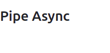
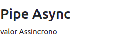
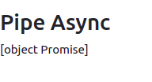
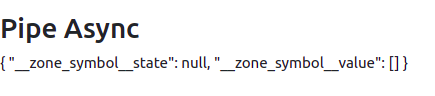
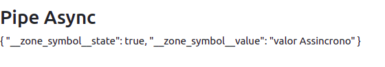

# __PIPE ASYNC__

Este pipe pode ser utilizado para renderizar elementos que dependem da saida de um valor que pode demorar para ser retornado, como exemplo o acesso ao banco de dados para retornar informacoes. Sao usados em conjunto com as interfaces `Promise` ou 

## __UTILIZANDO `PROMISE`__
No primeiro exemplo, vamos utilizar a interface `Promise`. Vamos declarar uma variavel chamada `valorAsync` e utilizar a funcao `setTimeout()` para simular o tempo de resposta do servidor.

___component_:__
```typescript
import { Component, OnInit } from '@angular/core';

@Component({
  selector: 'app-pipe-async',
  templateUrl: './pipe-async.component.html',
  styleUrls: ['./pipe-async.component.css']
})
export class PipeAsyncComponent implements OnInit {

  // interface Promise armazenada em uma variavel
  valorAsync = new Promise((resolucao, rejeicao) => 
    setTimeout(() => resolucao('valor Assincrono'), 2000)
  )

  constructor() { }

  ngOnInit(): void {
  }

}
```
___template_ do _component_:__
```HTML
<div>
    <h3>Pipe Async</h3>
    <div>
        {{ valorAsync | async }}
    </div>

</div>
```
o comportamento do exemplo implementado seguira com a renderizacao dos _components_ e apos o _timeout_ de 2s o conteudo da variavel `valorAsync` sera exibido no template.

<p align="center">
    <br>
    figura 1 - pipe antes do timeout
</p>

<p align="center">
    <br>
    figura 2 - pipe depois do timeout (apos 2 segundos)
</p>

para exemplificar melhor vamos implementar o template sem o pipe async. para o caso onde nenhum pipe e aplicado o valor retornado e o tipo do objeto, ja que no momento da renderizacao o valor nao foi retornado.

```HTML
div>
    <h3>Pipe Async</h3>
    <div>
        <!-- sem pipe implementado -->
        {{ valorAsync }}
    </div>

</div>
```

<p align="center">
    <br>
    figura 3 - template sem pipe implementado
</p>

podemos aplicar o pipe json (nativo do Angular), para ver o conteudo do objeto.

```HTML
<div>
    <h3>Pipe Async</h3>
    <div>
        <!-- pipe json implementado -->
        {{ valorAsync | json }}
    </div>

</div>
```
<p align="center">
    <br>
    figura 4 - pipe json implementado antes do timeout
</p>

<p align="center">
    <br>
    figura 2 - pipe json implementado depois do timeout (apos 2 segundos)
</p>

note que o valor e armazenado no atributo `__zone_symbol__value` apos decorrido o tempo de timeout.

#
## __UTILIZANDO OBSERVABLE__

de forma similar a implementacao anterior podemos utilizar a interface `Observable` conforme o exemplo a seguir, o comportamento ira manter-se igual.

___component_:__
```typescript
import { Component, OnInit } from '@angular/core';
import { interval } from 'rxjs';
import { map } from 'rxjs/operators'

@Component({
  selector: 'app-pipe-async',
  templateUrl: './pipe-async.component.html',
  styleUrls: ['./pipe-async.component.css']
})
export class PipeAsyncComponent implements OnInit {

  // observable
  valorAsync = interval(2000).pipe(map(valor => 'Valor Assincrono'))

  constructor() { }

  ngOnInit(): void {
  }

}
```

o template mante-se inalterado.

para mais informaceos sobre `observable` leia a documentacao oficial do Angular [The RxJS library](https://angular.io/guide/rx-library)