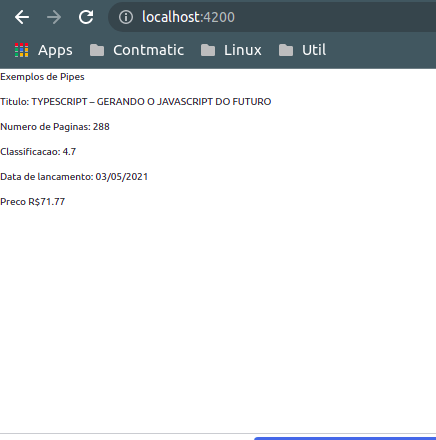
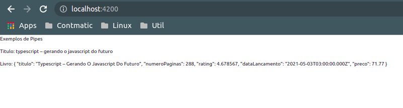

# __USANDO PIPES, PARAMETROS E PIPES ANINHADOS__

pipes sao filtros para realizar a formatacao de dados nos _templates_, existem diversos casos, vamos tomar alguns exemplos. para mais informacoes sobre pipes nativos do `Angular` consulte [angular commom packge](https://angular.io/api/common) na secao pipes.

vamos criar uma classe que contem um objeto livro que contem alguns atributos como, titulo, numero de paginas, rating, data de lancamento, preco, e aplicar alguns pipes para exibir o conteudo, a sixtaxe padrao e composta pelo char pipe (|) separando a variavel do pipe. 

___component___:
```typescript
import { Component, OnInit } from '@angular/core';

@Component({
  selector: 'app-usando-pipes-parametros-e-pipes-aninhados',
  templateUrl: './usando-pipes-parametros-e-pipes-aninhados.component.html',
  styleUrls: ['./usando-pipes-parametros-e-pipes-aninhados.component.css']
})
export class UsandoPipesParametrosEPipesAninhadosComponent implements OnInit {

  livro: any = {
    titulo: 'Typescript – Gerando O Javascript Do Futuro',
    numeroPaginas: 288,
    rating: 4.678567,
    dataLancamento: new Date(2021, 4, 3),
    preco: 71.77
  }

  constructor() { }

  ngOnInit(): void {

  }

}
```

___template_ do _component___
```HTML
<p>Exemplos de Pipes</p>
<p>Titulo: {{ livro.titulo | uppercase }}</p>
<p>Numero de Paginas: {{ livro.numeroPaginas | number }}</p>
<p>Classificacao: {{ livro.rating | number:'1.1-1'}}</p>
<p>Data de lancamento: {{ livro.dataLancamento | date:'dd/MM/yyyy' }}</p>
<p>Preco {{ livro.preco | currency:'BRL':true }}</p>
```


<p align="center">
    <br>
    figura 1 - aplicacao de pipes no template
</p>

#
### __PIPES ANINHADOS E `json` PIPE__

para aninhar os pipes basta separar por pipes, a ordem de execucao seguira a ordem de declaracao da esquerda para a direita. Outro pipe relevante de ser demonstrado e o `json` que convert um objeto em `javascript` para um `json`.

___template_ do _component___
```HTML
<p>Exemplos de Pipes</p>
<p>Titulo: {{ livro.titulo | uppercase | lowercase }}</p>
<p>Preco {{ livro.preco | currency:'BRL':true }}</p>
```

note que no exemplo o titulo sera convertido para caixa-alta e depois para caixa-baixa.

<p align="center">
    <br>
    figura 2 - pipes aninhados e json pipe
</p>