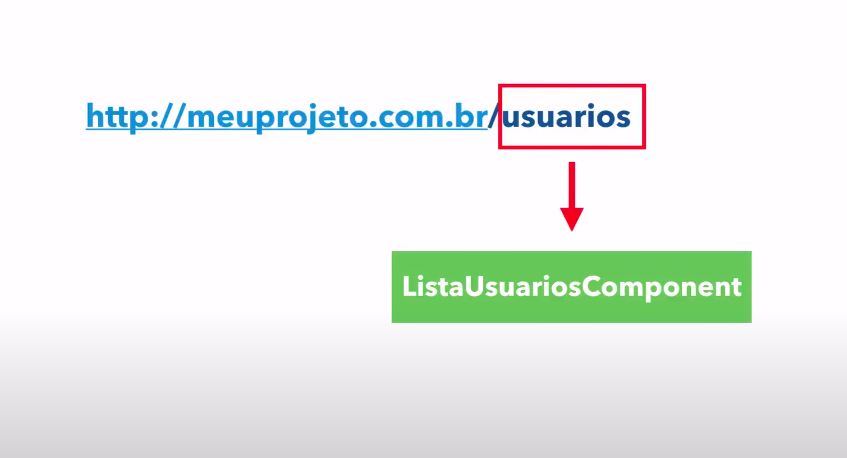
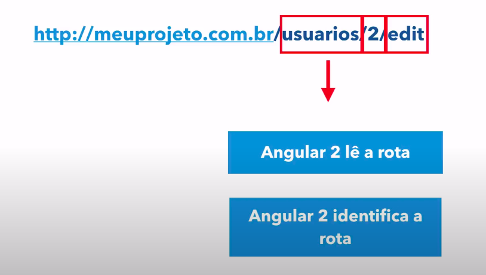
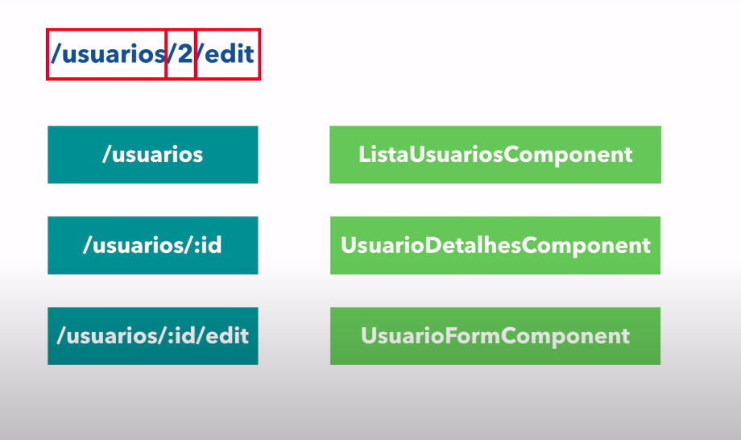

# __INTRODUCAO A ROTAS__

## __PRE-REQUISITO__
Para entender o conceito de rotas, antes precisamos compreender o conceito de SPA (Single Page Application), que consiste em ter todo o conteudo da applicacao web carregado de forma dinamica em torno de apenas uma unica pagina, ou seja apenas os elementos necessarios sao alterados conforme necessario, como por exemplo a interacao de um usuario com um menu, o menu nao necessita ser renderizado novamente, apenas o conteudo referente a escolha do usuario, devido a isso nao ocorre o recarregamento da pagina e sim a alteracao do conteudo vizualizado pelo usuario, em alguns casos a aplicacao SPA cominica-se com o servidor para realizar a alteracao dinamica do conteudo da pagina. o Angular 2 segue o conceito de SPA.

#
## __ROTAS__ 

As rotas sao responsaveis por organizar a interacao do usuario exibindo o conteudo desejado de acordo com a rota solicitada atraves da `url`

     
    figura 1 - rota simples que ira carregar um determinado component.

as rotas podem ser complementadas, e os parametros fornecidos a rota sao separados por barras, e similar a __figura 1__ outro _component_ sera carregado.

     
    figura 2 - rota simples com varios parametros fornecidos.

diferentes rotas irao apontar para diferentes _components_

     
    figura 3 - rotas e seus respectivos components.

