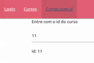

# Definindo e Extraindo Parametros de Roteamento

para obter uma rota que espera receber parametros, o primeiro passo e declarar a rota no arquivo `app.routing.ts`, neste exemplo iremos declarar a rota `cursos/:id`, note que o nome do parametro e prececido por `:` para identificar que se trata de um parametro.

```typescript
{ path: 'curso/:id', component: CursoDetalheComponent }
```
um novo _component_ foi criado para este exemplo. Apenas para exemplificar como obter um valor ou passar o valor para a rota, na pagina incial `app.component.html`, iremos inserir uma nova opcao na barra de navegacao e um campo input para inserir algum valor que posteriormente sera o argumento para a rota.

```HTML
<nav>
    <div class="nav-wrapper">
        <a routerLink="" class="brand-logo right">Rotas Ng2</a>
        <ul id="nav-mobile" class="left hide-on-med-and-down">
          <li routerLinkActive="active"><a routerLink="/login">Login</a></li>
          <li routerLinkActive="active"><a routerLink="/cursos">Cursos</a></li>

          <!-- nova rota inserida -->
          <li routerLinkActive="active"><a [routerLink]="['curso', id_curso.value]">Cursos com Id</a></li>
        </ul>
    </div>
</nav>
<div class="container">
    <p>Entre com o id do curso</p>

    <!-- campo para receber o id -->
    <input #id_curso>
    <router-outlet></router-outlet>
</div>
```

note que foi declarada uma variavel local `#id_curso` que sera utilizada para passar o valor digitado no campo `input` para a diretiva `routerLink`, neste caso e possivel fazer property Binding passando um array onde o primeiro elemento e a rota e os demais sao os argumentos para os parametros.

Para este exemplo foi criado o `CursoDetalheCompoenet`, o pacote `@angular/router` possui um classe `ActivatedRoute` que possui diversos metodos para trabalhar com rotas (injetada no component por injecao de dependencias do angular, via construtor), utilizamos o `console.log()` para verificar a estrutura do objeto, e podemos verificar que o objeto `route` possui o atributo `snapshot` que e um registro instantaneo da rota, logo por meio dele podemos pegar o valor do id (parametro declarado na rota no arquivo `app.routing.ts`).

```typescript
import { Component, OnInit } from '@angular/core';
import { ActivatedRoute } from '@angular/router';

@Component({
  selector: 'app-curso-detalhe',
  templateUrl: './curso-detalhe.component.html',
  styleUrls: ['./curso-detalhe.component.css']
})
export class CursoDetalheComponent implements OnInit {

  id: string = "";

  constructor(private route: ActivatedRoute) {
    // console.log(this.route);
    this.id = this.route.snapshot.params['id'];
   }

  ngOnInit(): void {
  }

}
```

no HTML do `CursoDetalheComponent` temos apenas uma interpolacao para exibir o valor retornado da rota.

```HTML
<p>
    id: {{ id }}
</p>
```

### Exemplo
<p align="center">
    <br>
</p>

## Problema

O captura dos dados pelo atributo `snapshot` da classe `ActivatedRoute` ocorre posteriormente a renderizacao do _component_, ou seja, no caso deste exemplo ao alterar o valor do campo input e mudar de rota o valor atribuito ao parametro `id` permanece o mesmo pois sera necessario renderizar novamente o _component_ com o valor antigo do atributo, e ao fim da renderizacao o novo valor e atribuido, e para que o novo valor seja visivel, deve-se renderizar novamente.

<p align="center">
    <br>
</p>