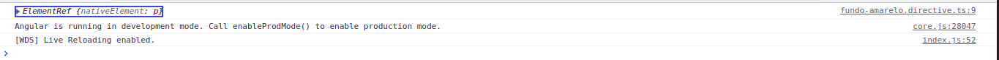
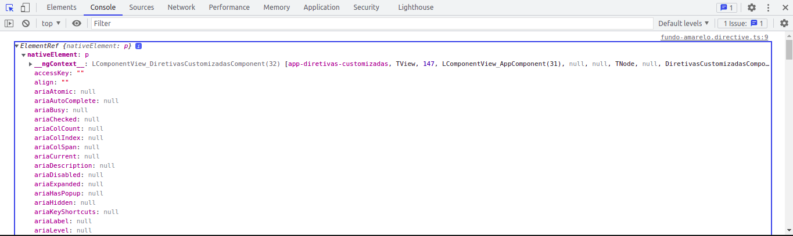

# ElementRef e Renderer

Para exemplificar a utilizacao de ambos, sarao criadas diretivas, lembrando que as diretivas sao divididas em estruturais e atributos. De modo geral as diretivas sao compartilhadas por toda a aplicacao, logo o ideal sera que estejam alocadas em um diretorio global, para facilicar sua utilizacao como por exemplo criar um diretorio no interior de app (ex: app/shared), porem para fins de exemplo serao alocadas no interior do diretorio _03-diretivas, pois o topico ElementRef e Renderer pertencem a este modulo do curso.

para gerar a diretiva de formar automatica utilizando o angular CLI basta utilizar o seguinte comando.

```bash
$ ng g d <nome-da-diretiva>
```
para este exemplo iremos criar uma diretiva e um component para utiliza-la.

Criando a diretiva

```bash
$ ng g d _03-diretivas/ElementRef-Renderer/fundo-amarelo/fundo-amarelo
```
Criando compoenet

```bash
$ ng g c _03-diretivas/ElementRef-Renderer/diretivas-customizadas
```
## ElementRef

O angular 2 passui uma classe chamada ElementRef, que recebe uma referencia do elemento HTML, vamos utilizar a injecao de dependencia para recuperar a referencia do elemento.
e implementar um log do console para verificar o conteudo da variavel _elementRef.

```typescript
import { Directive, ElementRef } from '@angular/core';

@Directive({
  selector: '[FundoAmarelo]'
})
export class FundoAmareloDirective {

  constructor(private _elementRef: ElementRef) {
    console.log(this._elementRef)
   }

}
```
vamos verificar o que sera exibido no console



podemos verificar que elementRef possui uma arvore grande de atributos, e contem o atributo backgroundColor no seguinte caminho _elementRef > nativeElement > style > backgroundColor.



utilizamos o console do chrome como exemplo e identificamos o caminho do atributo backgroundColor, vamos implementalo em nosso codigo.

```typescript
import { Directive, ElementRef } from '@angular/core';

@Directive({
  selector: '[FundoAmarelo]'
})
export class FundoAmareloDirective {

  constructor(private _elementRef: ElementRef) {
    console.log(this._elementRef)
    this._elementRef.nativeElement.style.backgroundColor = 'yellow' // atribuicao da cor amarela
   }

}
```
podemos aplicar em elementos de outro tipo, como exemplo um button

```HTML
<button fundoAmarelo>Clique aqui</button>
```
para tornar a diretiva aplicavel somente a um tipo especifico de elemento, basta inserir a tag do elemento no soletor do decorator @Directive, confome os exemplos abaixo.

diretiva aplicavel apenas a tag p
```typescript
selector: 'p[FundoAmarelo]'
```
diretiva aplicavel apenas a tag button
```typescript
selector: 'button[FundoAmarelo]'
```
diretiva aplicavel soemente ao component elvis
```typescript
selector: 'app-elvis-operator[FundoAmarelo]'
```
Apesar da praticidade na utilizacao do elementRef na documentacao do angular existe uma recomendacao para nao utilizar este metodo, pois os atributos sao acessados diretamente, o que pode causar vunerabilidades para ataques do tipo xxs (cross scripting)

## Renderer
Para realizar a mesma logica que o elementRef, porem de forma segura temos o Renderer2, que e uma classe que realiza a renderizacao do component, e torna o acesso aos atributos mais seguro. Existem diversos metodos para realizar o set de atributos, como queremos alterar um atributo relativo ao estilo, vamos utilizar o metodo setElementStyle(), que recebe 3 argumentos, o primeiro parametro e o renderElement que recebe como argumento o caminho para o atributo, o segundo parametro recebe como argumento qual atributo ira ser modificado, e o terceiro parametro recebe como argumento o valor.

```typescript
import { Directive, ElementRef, Renderer2 } from '@angular/core';

@Directive({
  selector: '[FundoAmarelo]'
})
export class FundoAmareloDirective {

  constructor(private _renderer: Renderer2, private _elementRef: ElementRef) {
    console.log(this._renderer)
    this._renderer.setElementStyle(
        this._elementRef.nativeElement,
        'background-color', // declarado conforme declara-se no HTML
        'yellow'
    ) // atribuicao da cor amarela
   }
}
```